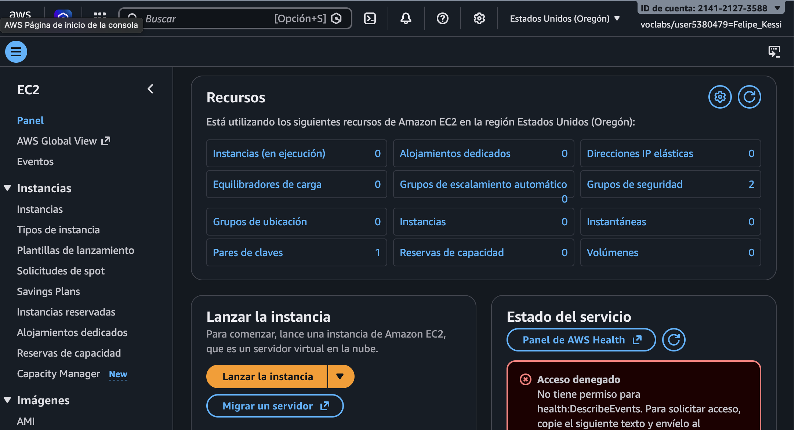
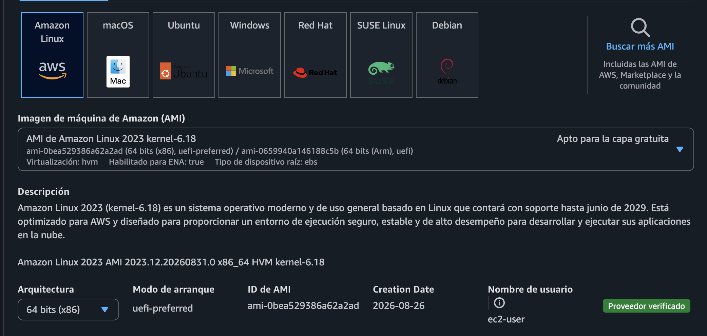
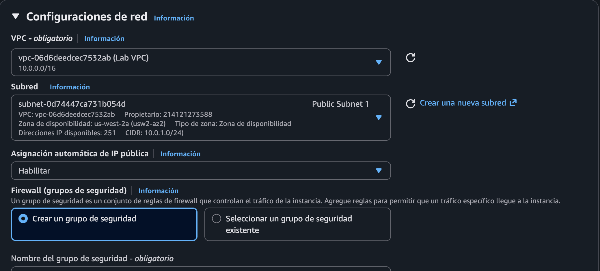
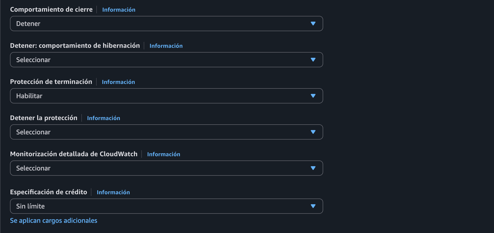
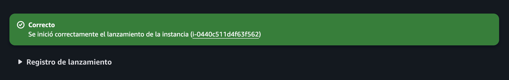
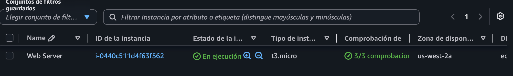
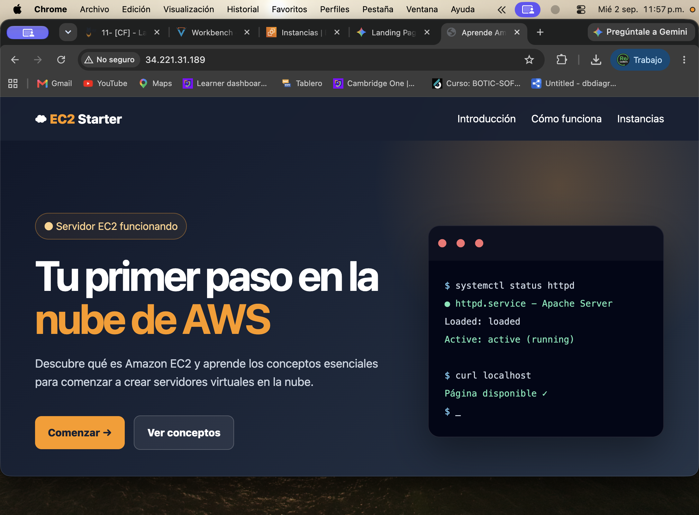
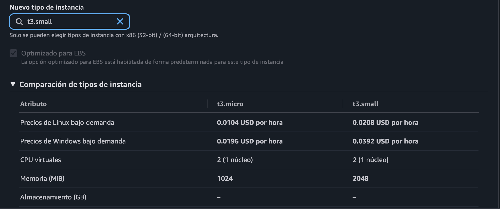
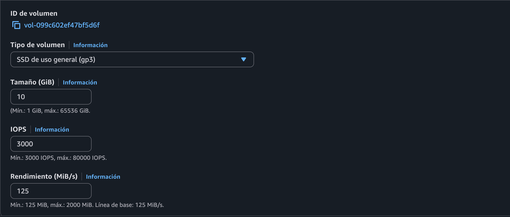
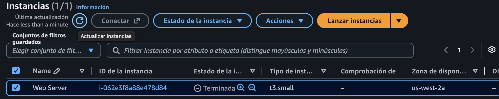

# Laboratorio 11 Introducción a Amazon EC2

**Módulo:** Fundamentos de la Nube  
**Región:** Estados Unidos Oeste Oregon `us-west-2`  
**Duración estimada:** 45 minutos  
**Fecha de ejecución:** 2 y 3 de septiembre de 2026

## Resumen

En este laboratorio se implementó y administró un servidor web en Amazon EC2. Se lanzó una instancia Amazon Linux 2023, se instaló Apache mediante datos de usuario, se habilitó el acceso HTTP, se supervisaron las comprobaciones de estado, se aumentaron la memoria y el almacenamiento y se comprobó la protección contra terminación accidental.

## Objetivos alcanzados

- [x] Lanzar un servidor web con protección de terminación.
- [x] Supervisar la instancia de EC2.
- [x] Permitir acceso HTTP mediante el grupo de seguridad.
- [x] Cambiar el tipo de instancia de `t3.micro` a `t3.small`.
- [x] Ampliar el volumen raíz EBS de 8 GiB a 10 GiB.
- [x] Probar la protección de terminación.
- [x] Terminar la instancia.

## Configuración

| Componente | Configuración |
|---|---|
| Nombre | `Web Server` |
| AMI | Amazon Linux 2023 de 64 bits x86 |
| Tipo inicial | `t3.micro`, 2 vCPU y 1 GiB |
| Tipo final | `t3.small`, 2 vCPU y 2 GiB |
| Red | Lab VPC y Public Subnet 1 en `us-west-2a` |
| Grupo de seguridad | Web Server Security Group |
| Almacenamiento | EBS `gp3`, ampliado de 8 GiB a 10 GiB |
| Acceso administrativo | Sin par de claves y sin regla SSH |

## Tarea 1 Lanzamiento de la instancia

Se abrió Amazon EC2 y se inició el asistente de lanzamiento.



Se asignó el nombre `Web Server`, se conservó Amazon Linux 2023 como AMI y se eligió `t3.micro`.



En la configuración de red se seleccionaron Lab VPC y Public Subnet 1. Se creó el grupo `Web Server Security Group`. No se habilitó SSH porque el laboratorio no requería acceso al sistema operativo.



Se mantuvo un volumen raíz EBS `gp3` de 8 GiB y se habilitó la protección de terminación.



### Datos de usuario

La guía proponía una página web mínima. En la ejecución se utilizó un script ampliado que instaló Apache y publicó una página educativa en español.

```bash
#!/bin/bash
yum install -y httpd
systemctl enable --now httpd

# Se crea /var/www/html/index.html con la página educativa.
chown apache:apache /var/www/html/index.html
chmod 644 /var/www/html/index.html
systemctl restart httpd
```

AWS confirmó que la instancia fue lanzada correctamente.



## Tarea 2 Supervisión

La instancia pasó a estado **En ejecución**. La consola mostró tres comprobaciones superadas: sistema, instancia y volumen EBS asociado.



La guía menciona 2 de 2 comprobaciones, pero la interfaz utilizada mostró 3 de 3. Esto es una variación de la consola actual, no un error del laboratorio.

## Tarea 3 Acceso al servidor web

El primer acceso mediante la IPv4 pública no respondió porque el grupo de seguridad no permitía tráfico por el puerto 80. Se agregó la siguiente regla entrante:

| Campo | Valor |
|---|---|
| Tipo | HTTP |
| Protocolo | TCP |
| Puerto | 80 |
| Origen | Anywhere IPv4 `0.0.0.0/0` |

Después de guardar la regla y actualizar el navegador, la página se mostró correctamente.



## Tarea 4 Cambio de tamaño

La instancia se detuvo de forma controlada antes de modificar su configuración. El tipo cambió de `t3.micro` a `t3.small`, duplicando la memoria de 1024 MiB a 2048 MiB y manteniendo 2 vCPU.



El volumen raíz EBS `gp3` se amplió de 8 GiB a 10 GiB, conservando 3000 IOPS y 125 MiB/s.



Al iniciar nuevamente la instancia, la IPv4 pública cambió. Esto es normal cuando se usa una dirección pública automática en lugar de una IP elástica.

## Tarea 5 Protección de terminación

El primer intento de eliminar la instancia fue rechazado porque la protección estaba activa. AWS indicó que debía modificarse el atributo `disableApiTermination`.


Después se desactivó la protección, se guardó el cambio y se repitió la operación. La instancia pasó a estado **Terminada**.



## Resultados y observaciones

- La instancia principal documentada fue `i-0440c511d4f63f562`.
- La prueba final de terminación muestra `i-062e3f8a88e478d84`, correspondiente a una segunda ejecución del laboratorio.
- La dirección IPv4 pública cambió después del ciclo de detención e inicio.
- La página personalizada mantuvo el objetivo técnico del laboratorio y permitió verificar Apache, los datos de usuario y el acceso HTTP.
- En un entorno real, después de ampliar un volumen EBS se debe verificar y, si corresponde, ampliar también el sistema de archivos.

## Conclusión

Se completó el ciclo de vida solicitado para Amazon EC2. La práctica demostró que una AMI y los datos de usuario permiten desplegar un servidor de manera automatizada; que los grupos de seguridad controlan el acceso de red; que las comprobaciones de estado facilitan la supervisión; y que los recursos de cómputo y almacenamiento pueden ajustarse según la carga. La prueba final confirmó que la protección de terminación evita eliminaciones accidentales hasta que se desactiva explícitamente.

## Recursos oficiales

- [Lanzamiento y uso de instancias](https://docs.aws.amazon.com/AWSEC2/latest/UserGuide/LaunchingAndUsingInstances.html)
- [Tipos de instancias de Amazon EC2](https://aws.amazon.com/ec2/instance-types)
- [Amazon Machine Images](https://docs.aws.amazon.com/AWSEC2/latest/UserGuide/AMIs.html)
- [Datos de usuario y scripts de shell](https://docs.aws.amazon.com/AWSEC2/latest/UserGuide/user-data.html)
- [Grupos de seguridad](https://docs.aws.amazon.com/AWSEC2/latest/UserGuide/using-network-security.html)
- [Comprobaciones de estado](https://docs.aws.amazon.com/AWSEC2/latest/UserGuide/monitoring-system-instance-status-check.html)
- [Cambio de tamaño de una instancia](https://docs.aws.amazon.com/AWSEC2/latest/UserGuide/ec2-instance-resize.html)
- [Detención e inicio de instancias](https://docs.aws.amazon.com/AWSEC2/latest/UserGuide/Stop_Start.html)
- [Terminación y protección](https://docs.aws.amazon.com/AWSEC2/latest/UserGuide/terminating-instances.html)

