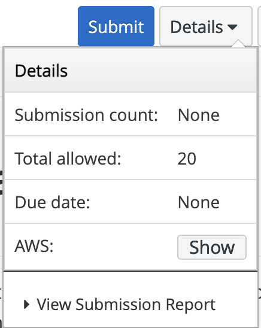
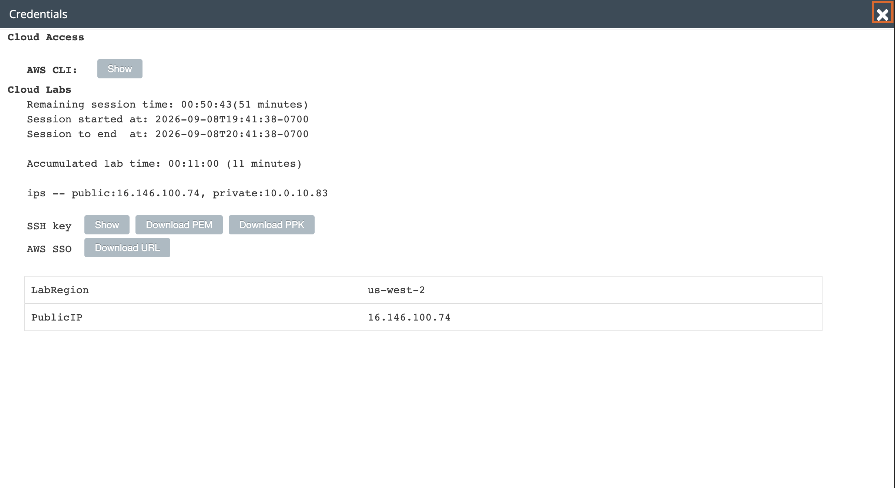
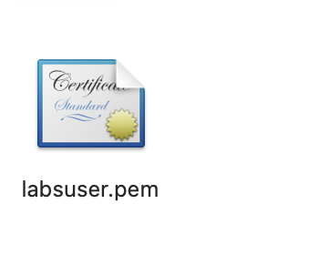
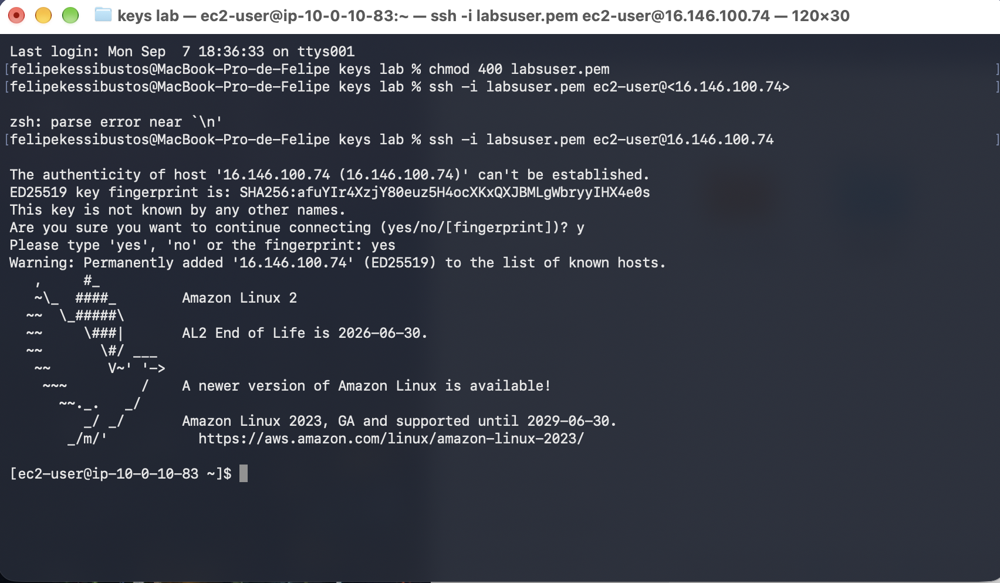
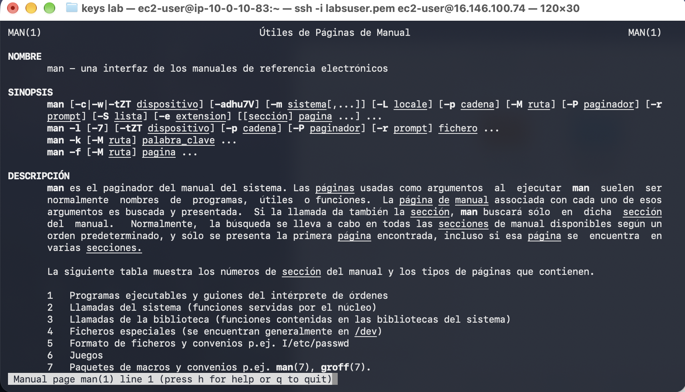

# Laboratorio 225 Introducción a la AMI de Amazon Linux

**Módulo:** Linux  
**Región:** us-west-2  
**Duración estimada:** 30 minutos  
**Entorno:** Vocareum y AWS

Este informe documenta el acceso por SSH a Amazon Linux y la exploración de sus páginas de manual. Las capturas confirman una conexión exitosa y la visualización de `man(1)`.


## Contenido

- [Objetivos](#objetivos)
- [Entorno del laboratorio](#entorno-del-laboratorio)
- [Acceso al entorno](#acceso-al-entorno)
- [Conexión mediante SSH](#conexión-mediante-ssh)
- [Exploración de las páginas de manual](#exploración-de-las-páginas-de-manual)
- [Resultados y evidencias](#resultados-y-evidencias)
- [Observaciones](#observaciones)
- [Cierre](#cierre)

## Objetivos

- Acceder mediante SSH a una instancia de Amazon Linux.
- Comprender el propósito del comando `man`.
- Explorar las búsquedas y los encabezados de las páginas de manual.

## Entorno del laboratorio

El entorno proporciona una instancia EC2 denominada **Command Host**, ubicada en una subred pública de una Amazon VPC.

- Sistema operativo observado: Amazon Linux 2.
- Usuario SSH: `ec2-user`.
- IP pública de la sesión: `16.146.100.74`.
- IP privada: `10.0.10.83`.
- Archivo de clave: `labsuser.pem`.
- Equipo utilizado: macOS.

## Acceso al entorno

La guía indica iniciar el entorno mediante **Start Lab**, esperar el estado **ready** y abrir la consola mediante **AWS**. Las capturas muestran el menú **Details**, el panel **Credentials** y el archivo descargado `labsuser.pem`. Desde el panel se obtuvo la IP pública para la conexión.

## Conexión mediante SSH

Desde la carpeta que contenía la clave, se ejecutó:

```bash
chmod 400 labsuser.pem
```

Este comando establece permisos de lectura únicamente para el propietario del archivo.

El primer intento incluyó los símbolos `< >` alrededor de la IP y produjo un error de sintaxis. Se corrigió utilizando:

```bash
ssh -i labsuser.pem ec2-user@16.146.100.74
```

En la confirmación de autenticidad del servidor se introdujo inicialmente `y`. El cliente solicitó la respuesta completa y se escribió `yes`.

La conexión fue exitosa. La captura muestra la bienvenida de Amazon Linux 2 y el indicador remoto:

```text
[ec2-user@ip-10-0-10-83 ~]$
```

## Exploración de las páginas de manual

La guía solicita ejecutar:

```bash
man man
```

El comando `man` permite consultar los manuales de comandos y otras funciones del sistema. La captura acredita la apertura de `man(1)` y muestra estos encabezados:

- **NOMBRE:** identificación y propósito del comando.
- **SINOPSIS:** sintaxis y opciones de uso.
- **DESCRIPCIÓN:** explicación del funcionamiento.

También se observa una tabla de secciones numeradas. Estas organizan contenidos como programas ejecutables, llamadas del sistema, funciones de biblioteca y formatos de archivos.

La guía enumera otros encabezados que pueden aparecer: **OVERVIEW, EXAMPLES, FILES, OPTIONS** y **SEE ALSO**. Indica desplazarse con las flechas y salir presionando `q`.

## Resultados y evidencias

- **Evidenciado:** obtención de datos de conexión, descarga de la clave y ejecución de `chmod 400`.
- **Confirmado:** conexión SSH a Amazon Linux 2 y visualización del manual de `man`.
- **Visible:** encabezados y números de sección del manual.
- **Sin evidencia:** búsquedas dentro del manual, salida con `q` y finalización con **End Lab**.

## Observaciones

Se resolvieron dos dificultades de conexión: los símbolos `< >` alrededor de la IP y la respuesta abreviada `y` en la confirmación del servidor.

Aunque la búsqueda en páginas de manual figura entre los objetivos, los fragmentos recibidos no incluyen un ejercicio explícito de búsqueda y las capturas no muestran su ejecución.

La guía menciona una instancia **t3.micro**, pero las capturas no permiten confirmar el tipo de instancia utilizado.

## Cierre

Las evidencias confirman el acceso por SSH y la consulta del manual. La guía indica finalizar el entorno mediante **End Lab → Yes**; no se adjuntó una captura de ese cierre.

## Capturas de la ejecución

### Menú Details y acceso a las credenciales



### Credenciales y datos de conexión de la sesión



### Archivo labsuser.pem descargado



### Conexión SSH y correcciones realizadas



### Página del manual y secciones visibles


