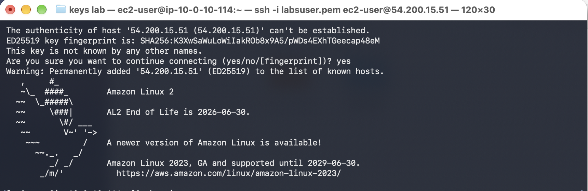
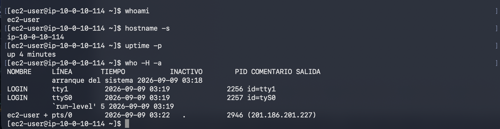
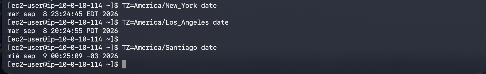
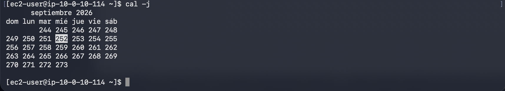
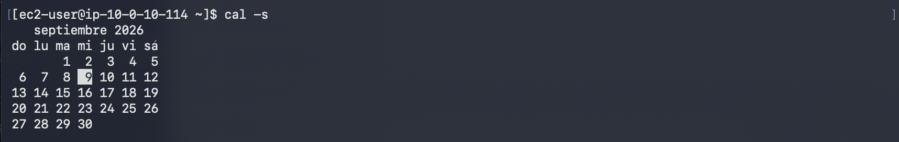
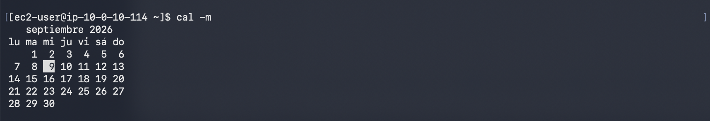
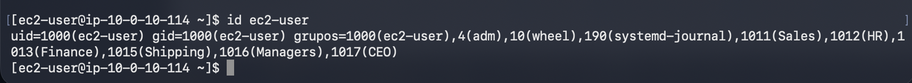
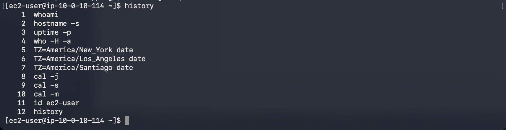
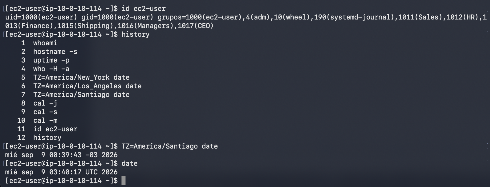
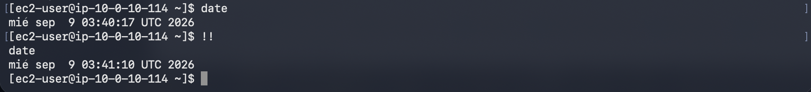

# Laboratorio 227 — Línea de comandos de Linux

## Objetivos y alcance

El laboratorio 227 de AWS re/Start permitió consultar información de una instancia Linux y reutilizar comandos de Bash. Las evidencias muestran una conexión SSH exitosa y la ejecución de los comandos principales.

Módulo: Linux. Región: us-west-2. Fecha de ejecución: 9 de septiembre de 2026. Duración estimada de la guía: 30 minutos. Registro: 4 fragmentos de instrucciones y 10 capturas.

Los objetivos fueron identificar el sistema y la sesión actual, consultar fechas y calendarios, y buscar y volver a ejecutar comandos anteriores.

## Tarea 1 Conexión SSH

Se accedió desde macOS a una instancia Amazon Linux 2 con el usuario ec2-user y la clave labsuser.pem. La primera captura muestra la aceptación de la clave del servidor y el mensaje de bienvenida.

La guía indicó proteger la clave y abrir la conexión con estos comandos; la captura acredita la conexión, pero no muestra la ejecución de chmod.

```bash
chmod 400 labsuser.pem
ssh -i labsuser.pem ec2-user@<public-ip>
```

## Tarea 2 Información del sistema

whoami devolvió ec2-user. hostname -s mostró ip-10-0-10-114. uptime -p indicó up 4 minutes. who -H -a presentó el arranque del sistema, las terminales y la sesión activa de ec2-user.

Las consultas con TZ mostraron Nueva York en EDT y Los Ángeles en PDT el 8 de septiembre, y Santiago en UTC−03 el 9 de septiembre. La consulta de Santiago fue una práctica adicional.

cal -j mostró septiembre de 2026 y destacó el día 252 del año, correspondiente al 9 de septiembre. cal -s organizó la semana desde el domingo y cal -m desde el lunes.

id ec2-user mostró UID 1000, GID 1000 y los grupos ec2-user, adm, wheel, systemd-journal, Sales, HR, Finance, Shipping, Managers y CEO.

```bash
whoami
hostname -s
uptime -p
who -H -a
TZ=America/New_York date
TZ=America/Los_Angeles date
TZ=America/Santiago date
cal -j
cal -s
cal -m
id ec2-user
```

## Tarea 3 Historial y búsqueda

history enumeró los comandos de la tarea anterior, incluida la consulta adicional de Santiago.

La guía propuso Ctrl+R, buscar TZ y pulsar Tab para recuperar y editar un comando. La evidencia muestra la nueva ejecución de TZ=America/Santiago date, aunque no registra directamente las teclas empleadas.

Se ejecutó date y después !!. Bash expandió !! a date y volvió a ejecutarlo: la primera salida fue 03:40:17 UTC y la segunda 03:41:10 UTC, ambas del 9 de septiembre de 2026.

```bash
history
# Búsqueda interactiva: Ctrl+R, escribir TZ y pulsar Tab
date
!!
```

## Cierre y aprendizajes

La guía indicó End Lab, confirmación con Yes y cierre del panel tras el inicio de la eliminación. El registro documental está cerrado; no hay captura que confirme la finalización de la sesión AWS.

Se practicó la identificación de usuario y host, la consulta de sesiones y tiempo de actividad, la comparación de zonas horarias y el uso de calendarios. El historial y !! permitieron consultar y reutilizar comandos.

Corrección conceptual: cal -j presenta el número de día del año. El 1 de febrero es el día 32 del año; no existe un «32 de febrero».

El autocompletado de whoami y la secuencia Ctrl+R no quedan verificados directamente en las capturas. La guía menciona t3.micro; las capturas no acreditan el tipo de instancia, por lo que no se atribuye una configuración de hardware a la instancia observada.

## Evidencias

### Evidencia 01 — Conexión SSH exitosa a Amazon Linux 2



### Evidencia 02 — Usuario host actividad y sesiones



### Evidencia 03 — Fecha y hora en Nueva York Los Ángeles y Santiago



### Evidencia 04 — Calendario con días del año



### Evidencia 05 — Calendario con inicio en domingo



### Evidencia 06 — Calendario con inicio en lunes



### Evidencia 07 — Identificador y grupos de ec2-user



### Evidencia 08 — Historial de los comandos ejecutados



### Evidencia 09 — Nueva ejecución de TZ y consulta de date



### Evidencia 10 — Repetición de date mediante dos signos de exclamación



## Fuentes

Instrucciones del laboratorio 227 proporcionadas en cuatro fragmentos y diez capturas de la ejecución. Este informe resume la práctica y no reproduce la guía completa.
