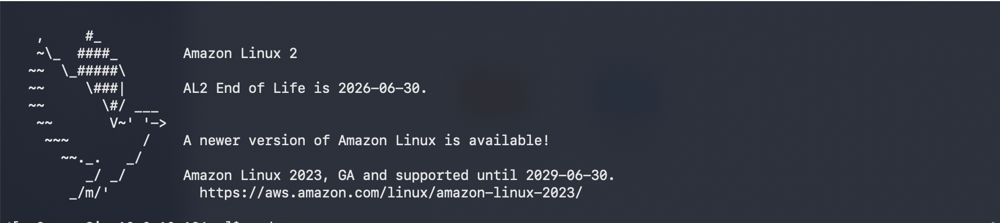
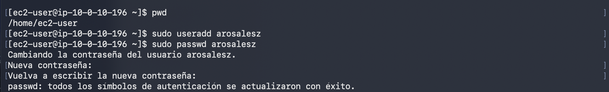
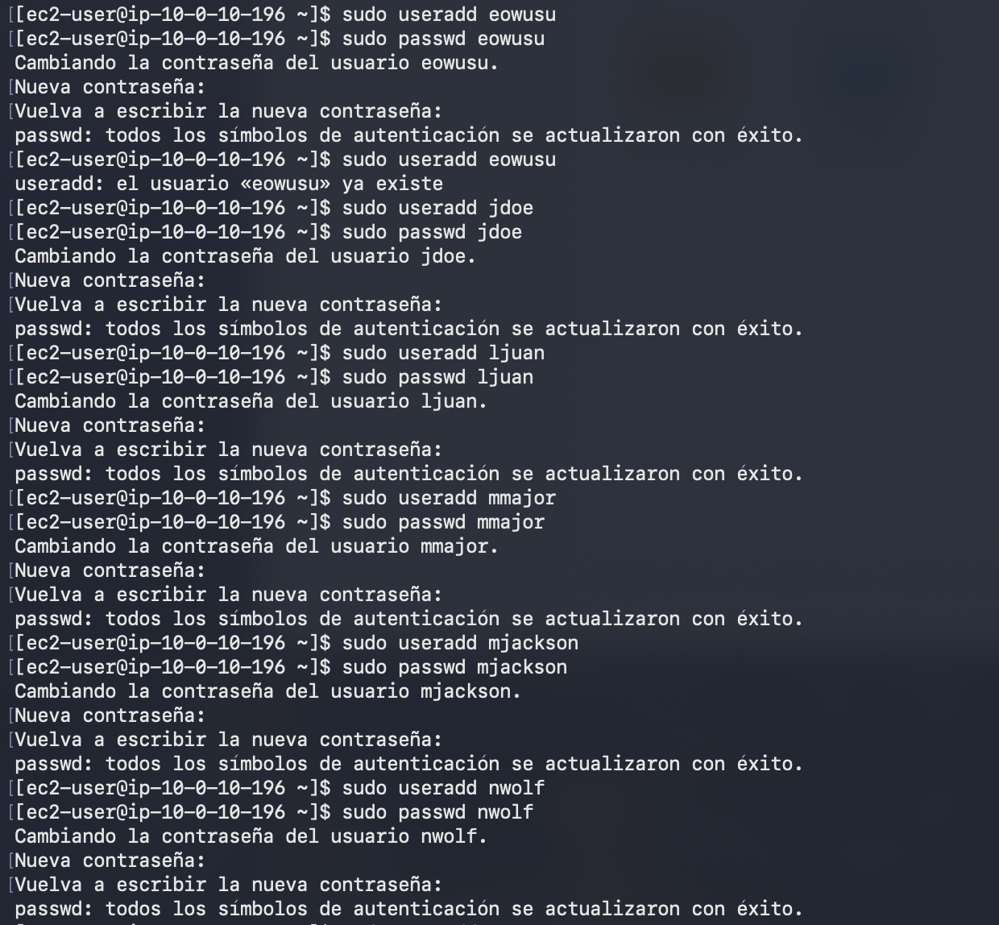
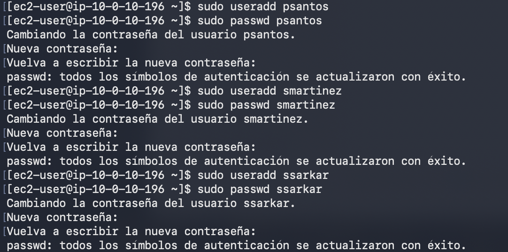
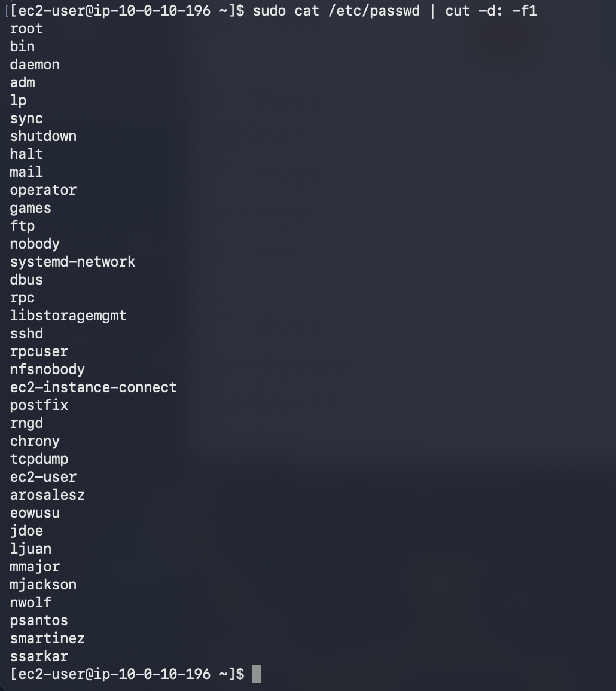
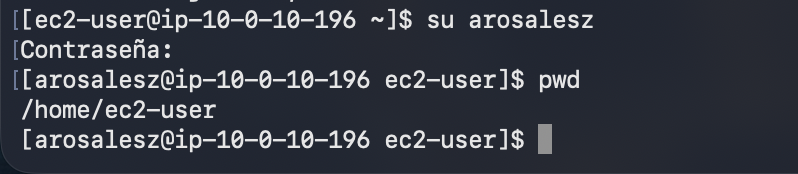
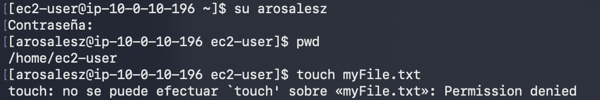
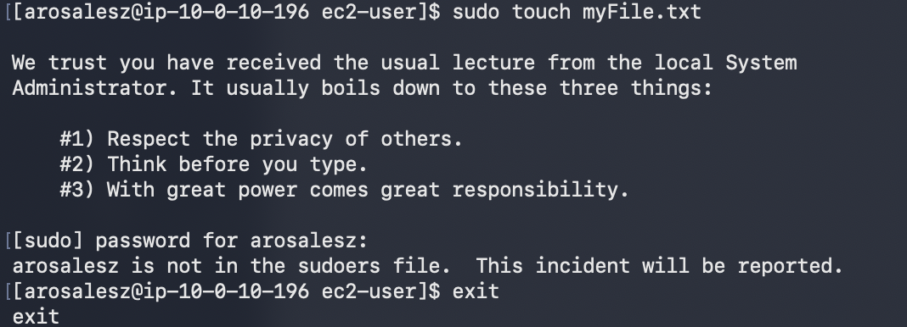
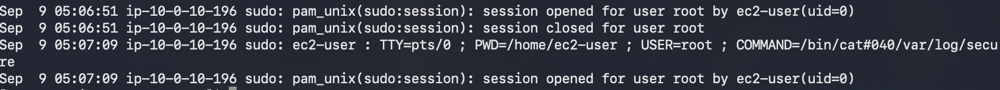
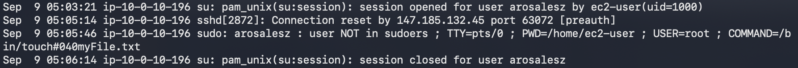

# Laboratorio 229 Administración de usuarios y grupos

Módulo: Linux · Región: us-west-2 · Duración estimada: 45 minutos · Sistema observado: Amazon Linux 2.

Este informe documenta la creación de cuentas, la asignación de grupos y las pruebas de permisos en una instancia EC2. Las capturas muestran diez cuentas creadas y los rechazos esperados al intentar escribir en un directorio ajeno y utilizar sudo sin autorización. La validación conserva las diferencias encontradas durante la ejecución.

## Objetivos y entorno

- Crear usuarios con una contraseña inicial predeterminada.
- Crear grupos y asignar usuarios según su función.
- Iniciar sesión con otro usuario y comprobar sus permisos.
- Consultar el registro de seguridad de las operaciones con sudo.

El entorno del laboratorio restringe los servicios y las acciones disponibles. La guía indica iniciar la sesión con Start Lab, esperar el estado ready y abrir la consola con AWS. El tipo de instancia indicado en la guía es t3.micro; las capturas no verifican su configuración de hardware.

## Tarea 1 Conexión mediante SSH

Para macOS o Linux, descargar labsuser.pem desde Details, anotar PublicIP y ejecutar lo siguiente, reemplazando `<public-ip>` por la dirección del laboratorio:

```bash
cd ~/Downloads
chmod 400 labsuser.pem
ssh -i labsuser.pem ec2-user@<public-ip>
```

La primera conexión solicita confirmar la identidad del servidor con yes. La autenticación utiliza la clave PEM. Al acceder a la instancia se mostró el mensaje de bienvenida de Amazon Linux 2.



## Tarea 2 Creación de usuarios

La guía establece estas diez cuentas y la contraseña inicial de práctica P@ssword1234! para todas ellas.

| ID previsto | Nombre | Función |
| --- | --- | --- |
| arosalez | Alejandro Rosalez | Sales Manager |
| eowusu | Efua Owusu | Shipping |
| jdoe | Jane Doe | Shipping |
| ljuan | Li Juan | HR Manager |
| mmajor | Mary Major | Finance Manager |
| mjackson | Mateo Jackson | CEO |
| nwolf | Nikki Wolf | Sales Representative |
| psantos | Paulo Santos | Shipping |
| smartinez | Sofía Martínez | HR Specialist |
| ssarkar | Saanvi Sarkar | Finance Specialist |

### Paso 1 Comprobar el directorio y crear la primera cuenta

Se ejecutó pwd y se obtuvo /home/ec2-user. A continuación, se creó la primera cuenta y se le asignó una contraseña mediante passwd. Los comandos visibles en la captura son:

```bash
pwd
sudo useradd arosalesz
sudo passwd arosalesz
```

La actualización de la contraseña terminó con éxito. La cuenta se escribió como arosalesz; el ID solicitado por la guía era arosalez. Esta diferencia se mantiene en las capturas posteriores.



### Paso 2 Crear las siguientes seis cuentas

Se crearon eowusu, jdoe, ljuan, mmajor, mjackson y nwolf, asignando una contraseña a cada cuenta. Se siguió el patrón mostrado para eowusu:

```bash
sudo useradd eowusu
sudo passwd eowusu
```

passwd solicitó la contraseña dos veces sin mostrar los caracteres. La captura registra actualizaciones exitosas para las seis cuentas. También muestra un segundo intento de crear eowusu: el sistema respondió que el usuario ya existía.



### Paso 3 Crear las últimas tres cuentas

Se añadieron psantos, smartinez y ssarkar y se establecieron sus contraseñas:

```bash
sudo useradd psantos
sudo passwd psantos
sudo useradd smartinez
sudo passwd smartinez
sudo useradd ssarkar
sudo passwd ssarkar
```

Las tres operaciones de cambio de contraseña finalizaron correctamente.



### Paso 4 Verificar el listado de usuarios

Se consultaron los nombres de las cuentas registradas en /etc/passwd:

```bash
sudo cat /etc/passwd | cut -d: -f1
```

La salida muestra las diez cuentas creadas. Nueve ID coinciden con la guía y la primera cuenta figura como arosalesz. Las capturas de passwd confirman que se establecieron contraseñas, pero no permiten verificar el valor ingresado.



## Tarea 3 Grupos y membresías

La distribución prevista por los pasos 30 a 36 es la siguiente:

| Grupo | Usuarios previstos |
| --- | --- |
| Sales | arosalez, nwolf, ec2-user |
| HR | ljuan, smartinez, ec2-user |
| Finance | mmajor, ssarkar, ec2-user |
| Shipping | eowusu, jdoe, psantos, ec2-user |
| Managers | arosalez, ljuan, mmajor, ec2-user |
| CEO | mjackson, ec2-user |

### Paso 1 Crear los grupos

El procedimiento indicado por la guía consiste en crear los seis grupos operativos:

```bash
sudo groupadd Sales
sudo groupadd HR
sudo groupadd Finance
sudo groupadd Shipping
sudo groupadd Managers
sudo groupadd CEO
```

### Paso 2 Asignar las membresías

La guía indica agregar cada usuario a los grupos de la tabla y añadir ec2-user a todos ellos. El siguiente es un ejemplo del comando solicitado:

```bash
sudo usermod -a -G Sales arosalez
cat /etc/group
```

Para completar la distribución, repetir sudo usermod -a -G `<grupo>` `<usuario>` por cada membresía de la tabla. Estos comandos representan el procedimiento previsto, no una transcripción de todas las operaciones ejecutadas. La opción -a conserva los grupos suplementarios existentes y -G indica los grupos suplementarios que se agregan.

### Paso 3 Comprobar los grupos de ec2-user

Se ejecutó el siguiente comando de verificación:

```bash
id ec2-user
```

La captura de grupos confirma que ec2-user pertenece a Sales, HR, Finance, Shipping, Managers y CEO. No muestra la membresía de las demás cuentas. Los números de grupo pueden diferir de los ejemplos de la guía.


Personnel aparece en la lista inicial del ejercicio, pero se omite en los comandos y en la tabla posterior. No hay evidencia de su creación ni de una asignación de miembros.

## Tarea 4 Cambio de usuario y permisos

### Paso 1 Iniciar sesión con la nueva cuenta

Se cambió de ec2-user a la cuenta realmente creada, arosalesz, y se comprobó el directorio actual:

```bash
su arosalesz
pwd
```

Tras ingresar la contraseña, el indicador de la terminal cambió a arosalesz. pwd devolvió /home/ec2-user: su sin guion conservó el directorio de trabajo en esta ejecución.



### Paso 2 Intentar crear un archivo

Desde /home/ec2-user, se intentó crear un archivo vacío:

```bash
touch myFile.txt
```

El sistema respondió Permission denied. La cuenta arosalesz no tenía permiso de escritura en el directorio de inicio de ec2-user.



### Paso 3 Intentar la operación con sudo y salir

Se intentó realizar la misma operación con sudo. Después de solicitar la contraseña, el sistema indicó que arosalesz no estaba en sudoers. Se ejecutó exit para regresar a la sesión anterior.

```bash
sudo touch myFile.txt
exit
```

El rechazo es el resultado esperado del ejercicio: la cuenta nueva no tenía autorización para ejecutar ese comando como administrador.



### Paso 4 Consultar el registro de seguridad

De regreso como ec2-user, se consultó el registro de seguridad:

```bash
sudo cat /var/log/secure
```

La siguiente captura registra la consulta del archivo realizada por ec2-user mediante sudo.



### Paso 5 Identificar el intento denegado

En el registro se identificó la entrada user NOT in sudoers para arosalesz. La entrada indica el directorio /home/ec2-user, el usuario destino root y el comando touch solicitado. También aparecen la apertura y el cierre de la sesión del usuario.



## Finalización del laboratorio

Los pasos 45 y 46 indican seleccionar End Lab, confirmar con Yes y cerrar el panel cuando se anuncie el inicio de la eliminación. No se aportó una captura que confirme este cierre.

## Observaciones y estado de verificación

- Nombre de usuario: arosalesz difiere de arosalez. No hay evidencia de una corrección; se mantiene el nombre observado en los resultados.
- Usuarios: se verifican diez cuentas creadas. Nueve coinciden con los ID de la guía.
- Grupos: se verifica la pertenencia de ec2-user a seis grupos; faltan evidencias de las membresías de los demás usuarios.
- Instancia: la captura de grupos muestra ip-10-0-10-114; las capturas de creación y permisos muestran ip-10-0-10-196. No se confirma una única instancia para toda la ejecución.
- Personnel: la propia guía no desarrolla su creación o membresías después de la lista inicial.
- Cierre: está descrito en las instrucciones, sin evidencia de ejecución.

## Aprendizajes

El ejercicio diferencia la existencia de una cuenta, la pertenencia a grupos, los permisos sobre directorios y la autorización para ejecutar sudo. La creación de usuarios no concede automáticamente privilegios de administración. Los registros de seguridad permiten revisar los intentos rechazados y asociarlos con una sesión y un comando.

## Fuentes y material de apoyo

Fuente principal: los cinco fragmentos de la guía del laboratorio 229 y las once capturas aportadas durante la ejecución. Este informe resume el trabajo y sus evidencias; no reproduce íntegramente la guía.

Recursos de AWS incluidos en la guía original:

- Tipos de instancia: https://aws.amazon.com/ec2/instance-types
- Imágenes AMI: https://docs.aws.amazon.com/AWSEC2/latest/UserGuide/AMIs.html
- Comprobaciones de estado: https://docs.aws.amazon.com/AWSEC2/latest/UserGuide/monitoring-system-instance-status-check.html
- Límites de EC2: https://docs.aws.amazon.com/AWSEC2/latest/UserGuide/ec2-resource-limits.html
- Terminación de instancias: https://docs.aws.amazon.com/AWSEC2/latest/UserGuide/terminating-instances.html

