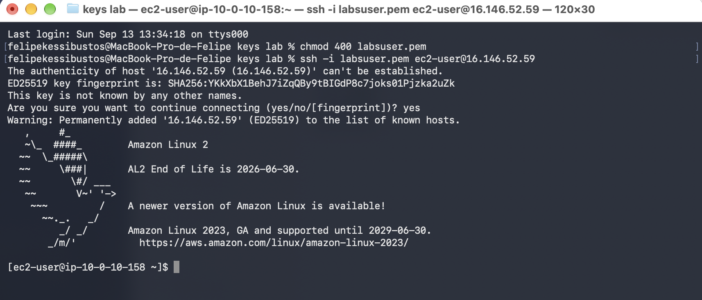
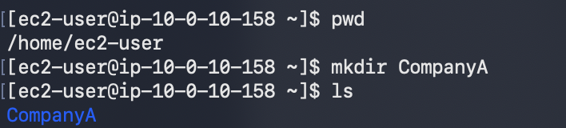
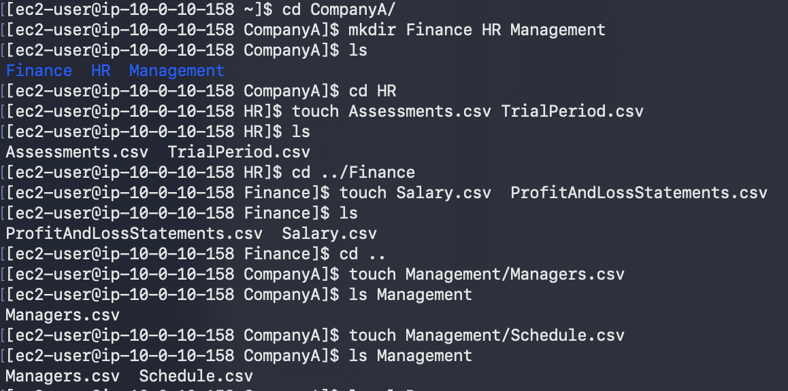
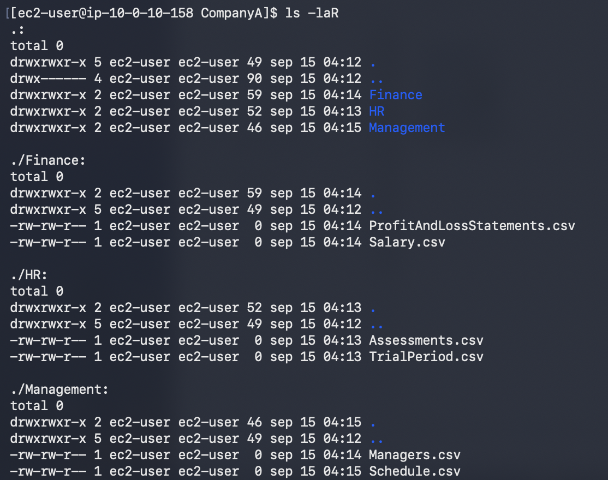
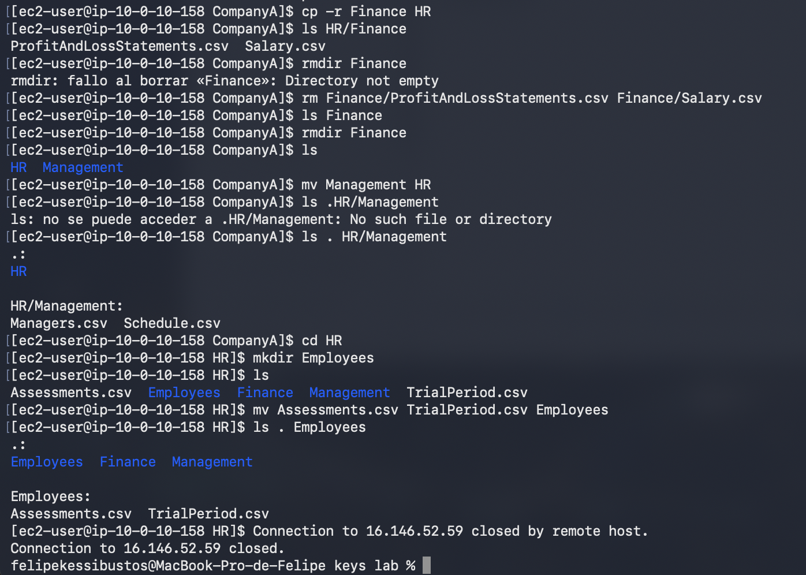

# 237 Administración de permisos de archivo

**ReCoders® 2026 · Felipe Kessi Bustos**

Módulo: Linux · Región: us-west-2 · Fecha: 15 de septiembre de 2026

Felipe Kessi Bustos · ReCoders® 2026

## Objetivos

Cambiar los permisos de carpetas y archivos según la estructura de grupos, modificar los permisos de archivo para un usuario y actualizar la estructura de carpetas de la empresa. Duración estimada: 35 minutos.

## Tarea 1 Conexión por SSH

La guía indica iniciar el laboratorio con Start Lab, esperar Lab status: ready y abrir AWS. En Details, seleccionar Show, descargar labsuser.pem y anotar PublicIP. El entorno puede restringir las acciones a las necesarias para el laboratorio.

Desde la carpeta local keys lab se ajustaron los permisos de la clave y se inició la conexión SSH:

```bash
chmod 400 labsuser.pem
ssh -i labsuser.pem ec2-user@34.210.58.100
```

Se respondió yes a la primera conexión. El terminal mostró la bienvenida de Amazon Linux 2.



*Captura 1. Permisos de la clave y acceso por SSH.*

## Tarea 2 Cambio de propiedad

Se ejecutó pwd y se obtuvo /home/ec2-user. El intento cd CompanyA falló; ls mostró companyA y se ingresó con el nombre correcto:

```bash
pwd
cd CompanyA
ls
cd companyA
```



*Captura 2. Verificación de la ubicación y acceso a companyA.*

Dentro de companyA se cambió recursivamente la propiedad de la estructura, de HR y de HR/Finance:

```bash
sudo chown -R mjackson:Personnel /home/ec2-user/companyA
sudo chown -R ljuan:HR HR
sudo chown -R mmajor:Finance HR/Finance
```



*Captura 3. Asignación de propietarios y grupos.*

companyA quedó asignada a mjackson:Personnel; HR, a ljuan:HR; y HR/Finance, a mmajor:Finance. El paso 26 menciona ctee en su descripción, pero el comando indicado y ejecutado utiliza ljuan.

A continuación se ejecutó ls -laR para comprobar los propietarios y grupos de toda la estructura.

```bash
ls -laR
```

## Tarea 2 Verificación de companyA y HR

El listado confirmó mjackson:Personnel en companyA y sus carpetas generales, ljuan:HR en HR y sus archivos de Employees, y mmajor:Finance en la carpeta Finance.



*Captura 4. Listado recursivo de companyA, HR y HR/Employees.*

## Tarea 2 Verificación de las subcarpetas

HR/Finance y sus archivos quedaron con mmajor:Finance. HR/Management y HR/NewHires conservaron ljuan:HR. Management, Sales y SharedFolders mostraron mjackson:Personnel en esta etapa.



*Captura 5. Propiedad de Finance, Management, NewHires y carpetas generales.*

Shipping también mostró mjackson:Personnel antes del cambio de la tarea 4.


*Captura 6. Propietario y grupo iniciales de Shipping.*

## Tarea 3 Cambio de modos de permiso

Se confirmó la ubicación /home/ec2-user/companyA con pwd. Se crearon los archivos con vi; la guía indica guardar y salir con ESC y :wq. Se aplicaron los modos simbólico y absoluto:

```bash
pwd
sudo vi symbolic_mode_file
sudo chmod g+w symbolic_mode_file
sudo vi absolute_mode_file
sudo chmod 764 absolute_mode_file
```


*Captura 7. Creación de archivos y aplicación de chmod.*

El modo simbólico g+w agregó escritura al grupo. El modo absoluto 764 asignó lectura, escritura y ejecución al propietario; lectura y escritura al grupo; y lectura a los demás.

```bash
ls -l
```


*Captura 8. Verificación de los permisos de los dos archivos.*

El listado confirmó symbolic_mode_file con -rw-rw-r-- y absolute_mode_file con -rwxrw-r--. Ambos archivos aparecen con propietario y grupo root:root.

## Tarea 4 Asignación a Shipping y Sales

Se confirmó la ruta de trabajo y se asignaron recursivamente los propietarios y grupos correspondientes:

```bash
pwd
sudo chown -R eowusu:Shipping Shipping
sudo chown -R nwolf:Sales Sales
```


*Captura 9. Cambio de propiedad de Shipping y Sales.*

Se listó el contenido y se verificaron ambas carpetas:

```bash
ls
ls -laR Shipping
ls -laR Sales
```


*Captura 10. Shipping con eowusu:Shipping y Sales con nwolf:Sales.*

Los resultados confirmaron eowusu:Shipping y nwolf:Sales. El pie de figura de la guía menciona otros usuarios; aquí se registran los que muestran los comandos y sus resultados.

## Cierre de la sesión

Se ejecutó exit. El terminal confirmó el cierre de la conexión a 34.210.58.100 y regresó al prompt local.

```bash
exit
```


*Captura 11. Cierre de SSH y regreso al terminal local.*

Para finalizar el entorno, la guía indica seleccionar End Lab, confirmar con Yes y cerrar el panel con X cuando se anuncie el inicio de la eliminación.
