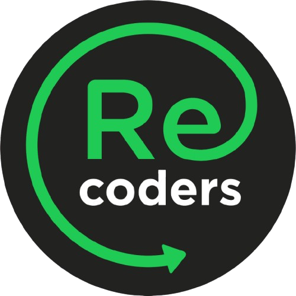
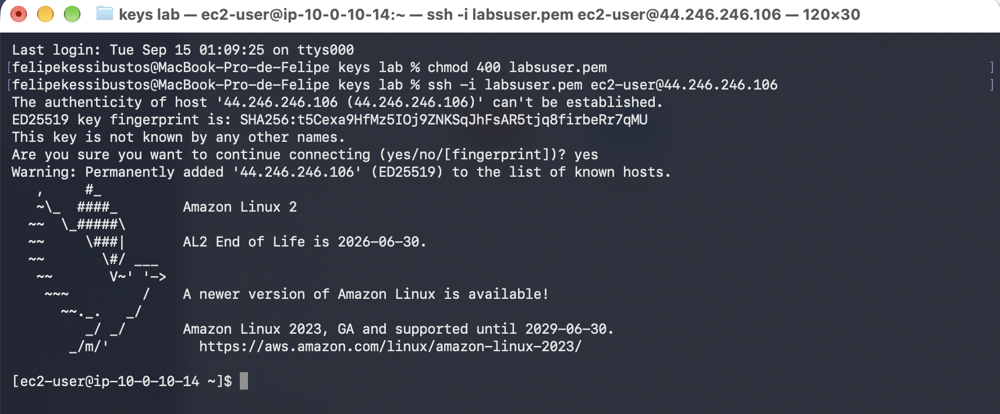
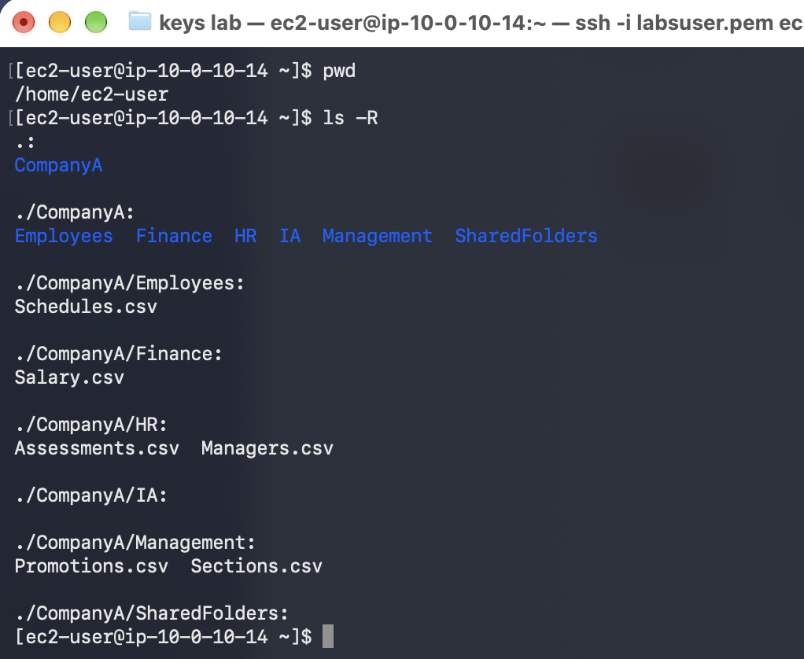
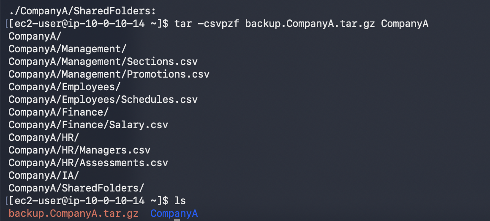
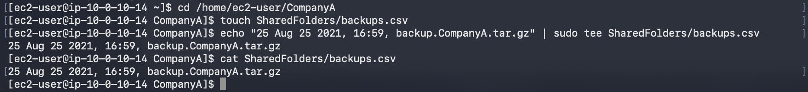
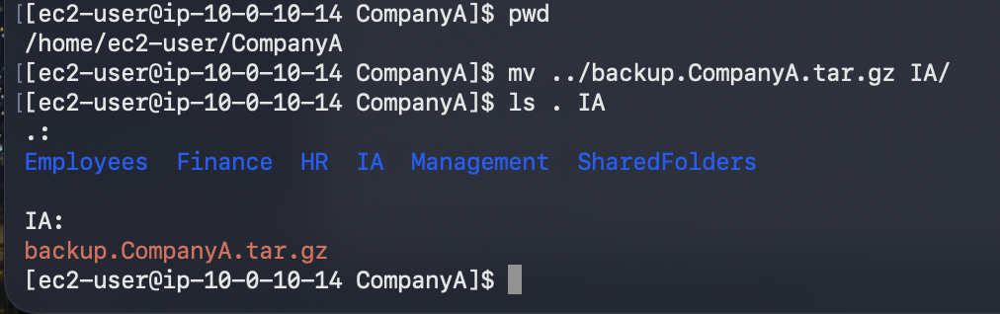
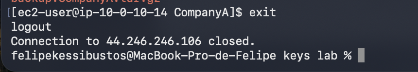

# 235 Trabajo con Archivos

**ReCoders® 2026 · Felipe Kessi Bustos**

Módulo: Linux · Región: us-west-2 · Fecha: 15 de septiembre de 2026

Autor: Felipe Kessi Bustos · ReCoders® 2026

## Objetivos

Crear con tar un respaldo de toda la estructura de CompanyA, registrar la fecha, hora y nombre del respaldo en un archivo y trasladarlo a otra carpeta. Duración estimada de la guía: 30 minutos.

## Tarea 1 Conexión por SSH

La guía indica iniciar el entorno con Start Lab, esperar el estado ready y abrir AWS. Para macOS/Linux, indica descargar labsuser.pem desde Details y obtener la dirección PublicIP.

En el terminal, desde la carpeta local keys lab, se ajustaron los permisos de la clave y se inició la conexión a la instancia:

```bash
chmod 400 labsuser.pem
ssh -i labsuser.pem ec2-user@44.246.246.106
```

Se respondió yes a la confirmación de la primera conexión. El terminal mostró Amazon Linux 2 y el prompt de ec2-user en ip-10-0-10-14.



*Captura 1. Permisos de la clave y conexión SSH a Amazon Linux 2.*

## Tarea 2 Verificación de la estructura

Se comprobó la ubicación de trabajo y se listó de forma recursiva su contenido:

```bash
pwd
ls -R
```

pwd devolvió /home/ec2-user. El listado mostró CompanyA y las carpetas Employees, Finance, HR, IA, Management y SharedFolders, con sus archivos correspondientes.



*Captura 2. Ubicación de trabajo y estructura de CompanyA.*

## Tarea 2 Creación del respaldo

Se creó el archivo de respaldo de CompanyA y se verificó su presencia:

```bash
tar -csvpzf backup.CompanyA.tar.gz CompanyA
ls
```

tar mostró las carpetas y archivos incluidos. El listado final mostró backup.CompanyA.tar.gz junto a CompanyA.



*Captura 3. Creación de backup.CompanyA.tar.gz y comprobación con ls.*

## Tarea 3 Registro del respaldo

Se ingresó a CompanyA, se creó SharedFolders/backups.csv y se escribió el registro con echo y tee. Después se comprobó su contenido con cat.

```bash
cd /home/ec2-user/CompanyA
touch SharedFolders/backups.csv
echo "25 Aug 25 2021, 16:59, backup.CompanyA.tar.gz" | sudo tee SharedFolders/backups.csv
cat SharedFolders/backups.csv
```



*Captura 4. Escritura y lectura del registro en backups.csv.*

Contenido verificado: 25 Aug 25 2021, 16:59, backup.CompanyA.tar.gz. Esta es la fecha escrita en el archivo durante la ejecución.

## Tarea 4 Traslado del respaldo

Se confirmó la ubicación CompanyA y se trasladó el respaldo desde la carpeta superior a IA:

```bash
pwd
mv ../backup.CompanyA.tar.gz IA/
ls . IA
```

pwd devolvió /home/ec2-user/CompanyA. El listado de IA mostró backup.CompanyA.tar.gz, confirmando el destino /home/ec2-user/CompanyA/IA/backup.CompanyA.tar.gz.



*Captura 5. Traslado del respaldo a IA y verificación del destino.*

## Cierre de la conexión

Se ejecutó exit. El terminal mostró logout y el cierre de la conexión, y regresó al prompt local.

```bash
exit
```



*Captura 6. Cierre de la sesión SSH y regreso al terminal local.*

## Finalización del entorno

La guía indica seleccionar End Lab, confirmar con Yes y cerrar el panel con X cuando aparezca el mensaje de eliminación iniciada.

## Resultados

Se creó backup.CompanyA.tar.gz, se registró su nombre junto con la fecha y hora indicadas en backups.csv y se trasladó el respaldo a IA. Las capturas muestran la verificación de cada resultado y el cierre de SSH.
