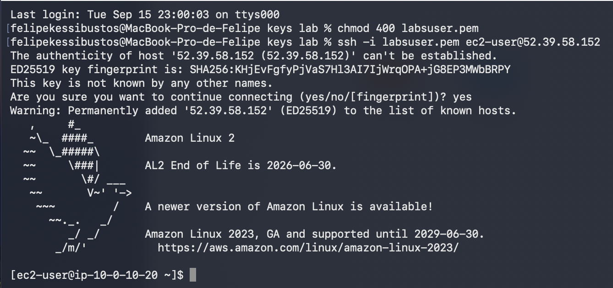
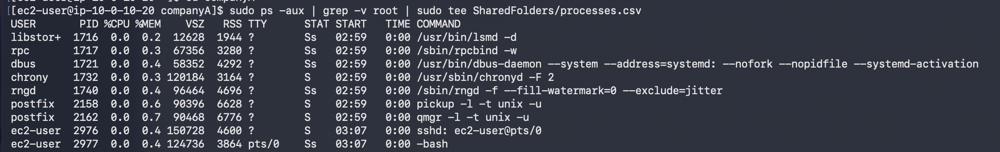
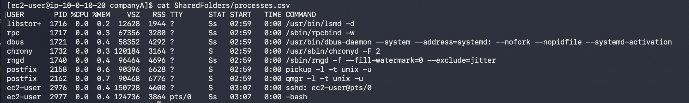
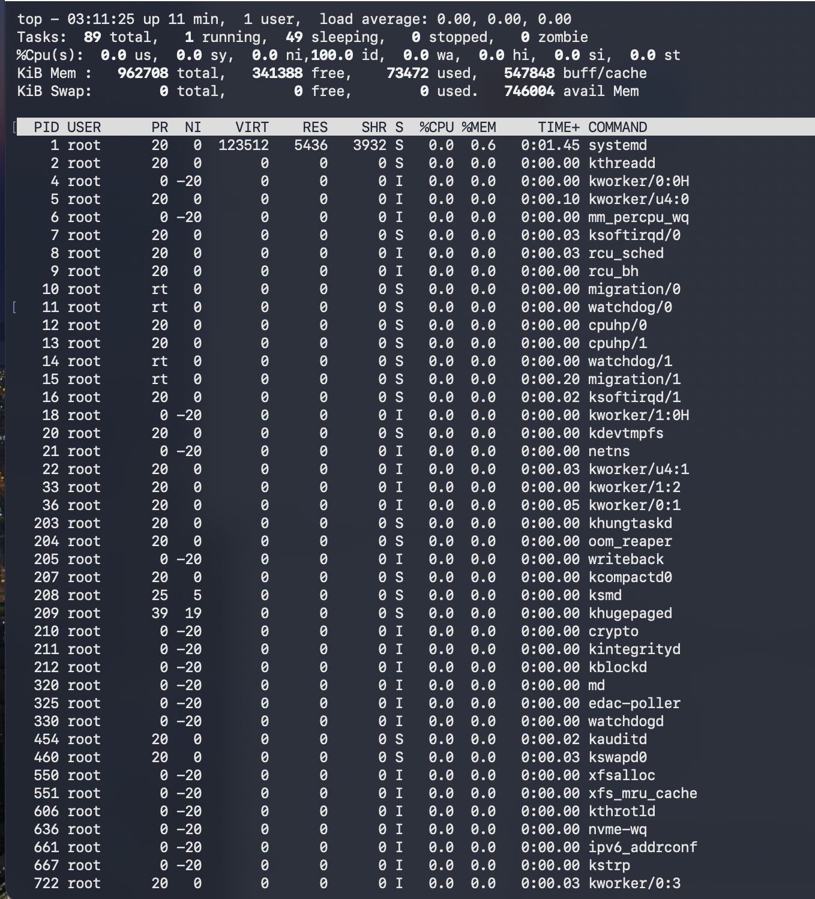
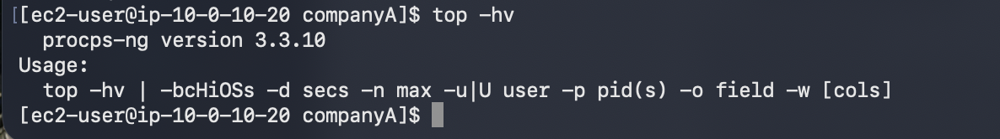
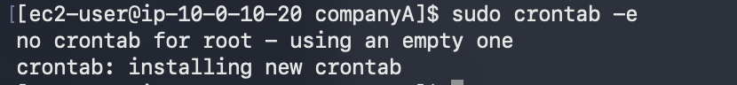
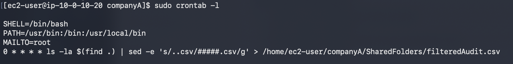
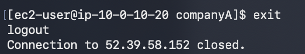

# 239 Administración de Procesos

**ReCoders® 2026 · Felipe Kessi Bustos**

Módulo: Linux · Región: us-west-2 · Fecha: 16 de septiembre de 2026

Felipe Kessi Bustos · ReCoders® 2026

## Objetivos

Crear un archivo de registro nuevo para listas de procesos, utilizar top y establecer una tarea repetitiva para ejecutar los comandos de auditoría una vez al día. Duración estimada: 45 minutos.

## Tarea 1 Conexión por SSH

Pasos 1 a 4 de la guía: seleccionar Start Lab, esperar Lab status: ready, cerrar el panel y abrir AWS. Si el navegador bloquea la nueva pestaña, permitir ventanas emergentes. El entorno restringe el acceso a los servicios y acciones necesarios para el laboratorio.

Pasos 13 a 17 para macOS/Linux: abrir Details > Show, descargar labsuser.pem, anotar PublicIP y cerrar el panel. Abrir un terminal y situarse en el directorio de la clave. La captura muestra la carpeta local keys lab.

Pasos 18 a 20: se ajustaron los permisos de la clave y se inició la conexión SSH:

```bash
chmod 400 labsuser.pem
ssh -i labsuser.pem ec2-user@52.39.58.152
```

Se aceptó la primera conexión con yes. El terminal mostró Amazon Linux 2 y el prompt [ec2-user@ip-10-0-10-20 ~]$.



*Captura 1. Permisos de la clave y conexión SSH a Amazon Linux 2.*

## Tarea 2 Crear una lista de procesos

Paso 21: la guía indica comprobar con pwd la ubicación /home/ec2-user/companyA y ejecutar cd companyA si corresponde. Las capturas de esta tarea muestran companyA en el prompt.

Paso 22: se creó el registro de procesos en SharedFolders, filtrando las líneas que contienen root:

```bash
sudo ps -aux | grep -v root | sudo tee SharedFolders/processes.csv
```



*Captura 2. Creación de SharedFolders/processes.csv con la lista filtrada.*

Paso 23: se consultó el archivo para verificar su contenido:

```bash
cat SharedFolders/processes.csv
```



*Captura 3. Lectura y verificación del archivo processes.csv.*

La salida muestra las columnas USER, PID, %CPU, %MEM, VSZ, RSS, TTY, STAT, START, TIME y COMMAND. Se observan procesos de libstor+, rpc, dbus, chrony, rngd, postfix y ec2-user.

## Tarea 3 Enumerar procesos con top

Paso 24: se ejecutó top para observar el rendimiento del sistema y la lista de procesos activos.

```bash
top
```

Paso 25: la captura muestra 89 tareas en total, 1 en ejecución, 49 en sleeping, 0 detenidas y 0 zombis. Respuesta a la pregunta de la guía: 1 tarea en ejecución.

## Tarea 3 Resultado de top



*Captura 4. Salida de top y estados de las tareas.*

Paso 26: la guía indica salir de top con q e Intro.

Paso 27: se ejecutó top -hv. El resultado aparece en la siguiente sección.

## Tarea 3 Información de uso y versión

```bash
top -hv
```



*Captura 5. Ayuda de top y versión procps-ng 3.3.10.*

## Tarea 4 Crear un trabajo cron

Paso 28: la guía indica verificar con pwd la ubicación /home/ec2-user/companyA. Las capturas muestran companyA en el prompt.

Pasos 29 a 35: se abrió el crontab de root. La guía indica entrar en modo de inserción con i, introducir las variables y el trabajo, y guardar con ESC y :wq.

```bash
sudo crontab -e
```

```bash
SHELL=/bin/bash
PATH=/usr/bin:/bin:/usr/local/bin
MAILTO=root
0 * * * * ls -la $(find .) | sed -e 's/..csv/#####.csv/g' > /home/ec2-user/companyA/SharedFolders/filteredAudit.csv
```



*Captura 6. Creación del crontab de root y mensaje de instalación.*

Paso 36: se verificó el contenido del crontab instalado:

```bash
sudo crontab -l
```



*Captura 7. Variables y trabajo cron verificados con crontab -l.*

La programación guardada es 0 * * * *, que ejecuta el trabajo cada hora, en el minuto 0. El objetivo inicial menciona una ejecución diaria; el comando registrado coincide con el paso 34 de la guía y con la captura. La evidencia confirma la instalación del trabajo, pero no muestra una ejecución ni el contenido de filteredAudit.csv.

## Cierre de la sesión SSH

Se ejecutó exit. El terminal mostró logout y confirmó el cierre de la conexión a 52.39.58.152.

```bash
exit
```



*Captura 8. Cierre de la conexión SSH.*

## Finalización del laboratorio

Pasos 37 y 38 de la guía: seleccionar End Lab y confirmar con Yes. Cuando aparezca el mensaje de inicio de la eliminación, cerrar el panel con X. No se adjuntó una captura de estas acciones en la consola.

## Resultados observados

Se creó y verificó SharedFolders/processes.csv, se consultaron los procesos con top y se obtuvo su información de uso y versión. Se instaló y verificó el crontab de root. Finalmente se cerró la sesión SSH.
