# 241 Administración de Procesos: Supervisión

**ReCoders® 2026 · Felipe Kessi Bustos**

Módulo: Linux · Región: us-west-2 · Duración indicada: 30 minutos

Felipe Kessi Bustos · ReCoders® 2026

## Objetivos del laboratorio

Verificar el estado del servicio httpd y comprobar la conexión HTTP al host. Supervisar una instancia EC2 de Amazon Linux 2 mediante top y AWS CloudWatch.

## Acceso al entorno y conexión SSH

Pasos 1–4. La guía indica seleccionar Start Lab, esperar Lab status: ready, cerrar el panel y abrir AWS. El acceso a servicios y acciones está restringido a lo necesario para el laboratorio.

Pasos 13–20. Para macOS/Linux, la guía indica abrir Details → Show, descargar labsuser.pem y anotar PublicIP. En el terminal, desde la carpeta keys lab, se ajustaron los permisos y se inició SSH:

```bash
chmod 400 labsuser.pem
ssh -i labsuser.pem ec2-user@34.220.250.104
```

Se respondió yes a la primera conexión. Se accedió a Amazon Linux 2 como ec2-user en ip-10-0-10-94.

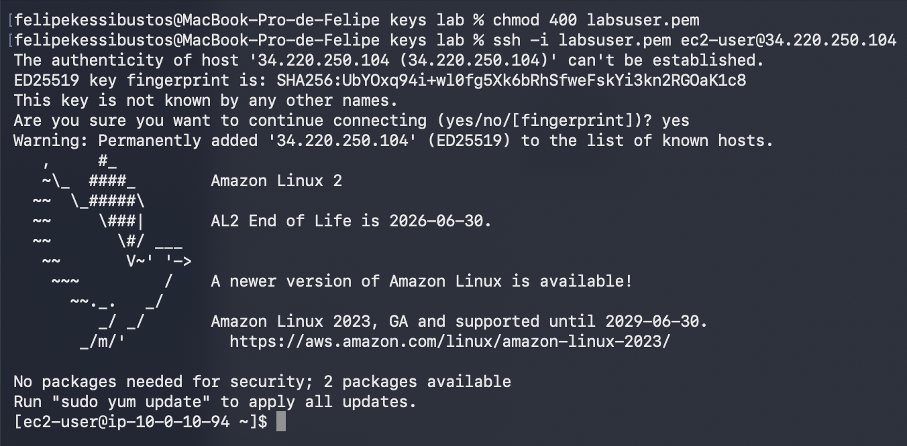

*Captura 1. Permisos de la clave y conexión SSH a Amazon Linux 2.*

## Tarea 2 Comprobar el servicio httpd

Pasos 21–23. Se consultó el estado de Apache, se inició el servicio y se volvió a consultar su estado:

```bash
sudo systemctl status httpd.service
sudo systemctl start httpd.service
sudo systemctl status httpd.service
```

El estado cambió de inactive (dead) a active (running). El servicio figuró como cargado y su PID principal fue 2591.

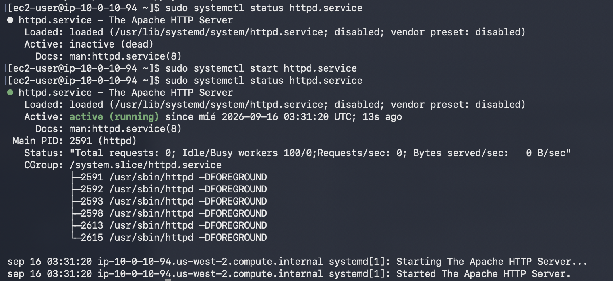

*Captura 2. Estado inicial, inicio y confirmación de httpd activo.*

Paso 24. Se abrió http://34.220.250.104 en el navegador. La página de prueba de Apache confirmó la respuesta HTTP del servidor.

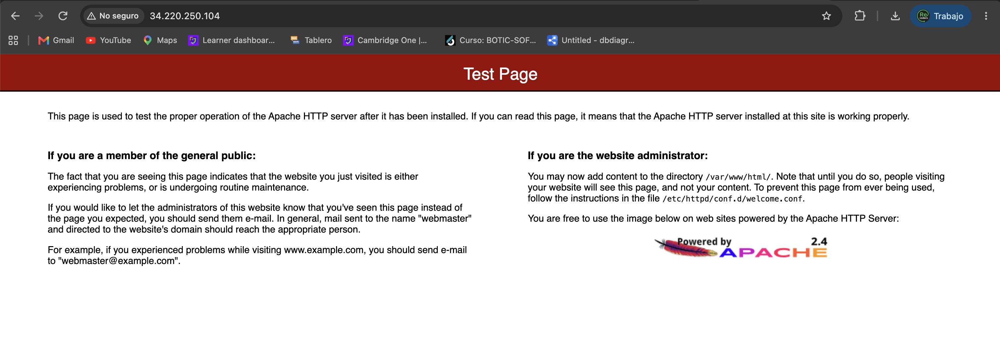

*Captura 3. Página de prueba de Apache en la IP pública.*

Paso 25. Se ingresó el comando para detener el servicio:

```bash
sudo systemctl stop httpd.service
```

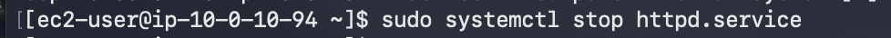

*Captura 4. Comando de detención de httpd.*

## Tarea 3 Supervisión inicial con top

Paso 26. Se ejecutó top para observar los procesos y el uso de CPU y memoria:

```bash
top
```

La captura inicial mostró 92 tareas y 100,0 % de CPU inactiva (id). La guía indica presionar Q para volver al intérprete de comandos.

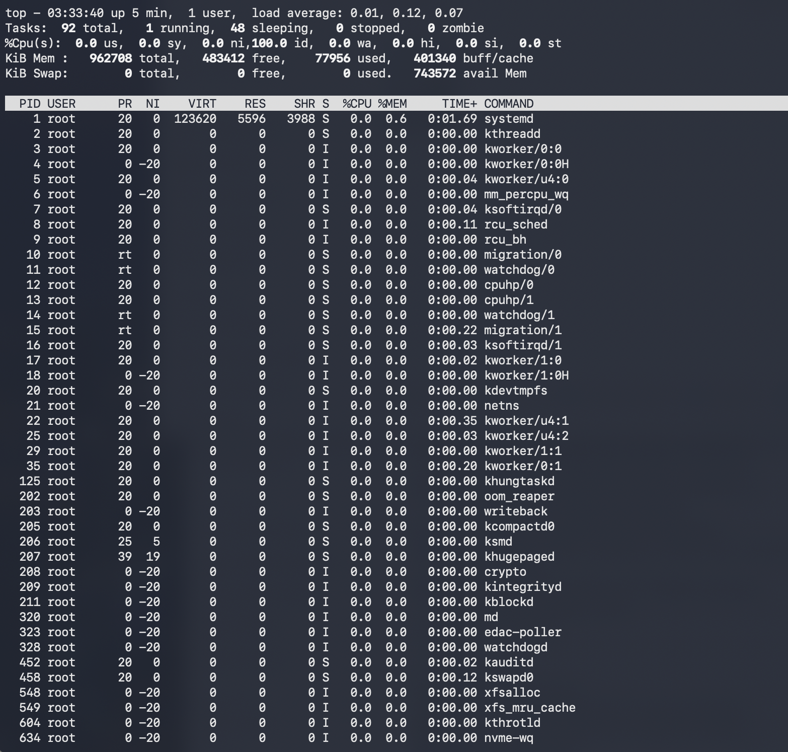

*Captura 5. Procesos y recursos antes de ejecutar la carga de trabajo.*

## Simular carga de trabajo en la instancia

Pasos 27–28. Se ejecutó el script en segundo plano junto con top:

```bash
./stress.sh & top
```

Se observaron procesos stress de ec2-user con valores de CPU entre 14,0 % y 14,7 %. El resumen mostró 62,2 % en usuario, 37,8 % en sistema y 0,0 % inactivo. Según la guía, el script se ejecuta durante seis minutos.

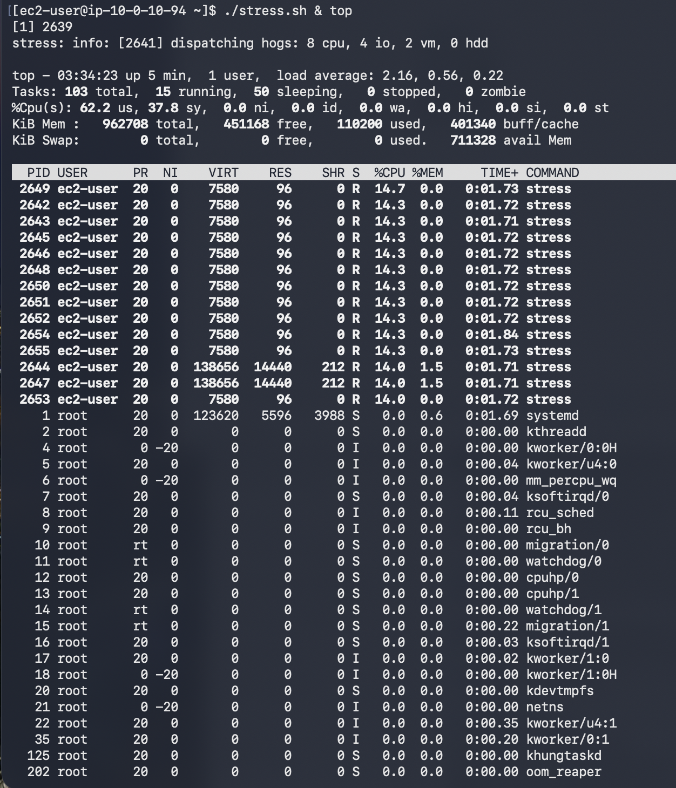

*Captura 6. Carga de trabajo generada por stress y supervisada con top.*

## Acceder a AWS CloudWatch

Paso 29. Se utilizó el botón AWS del entorno del laboratorio para acceder a la consola.


*Captura 7. Botón AWS del entorno del laboratorio.*

Paso 30. En la consola, se buscó CloudWatch. La región visible fue Estados Unidos (Oregón), correspondiente a us-west-2.

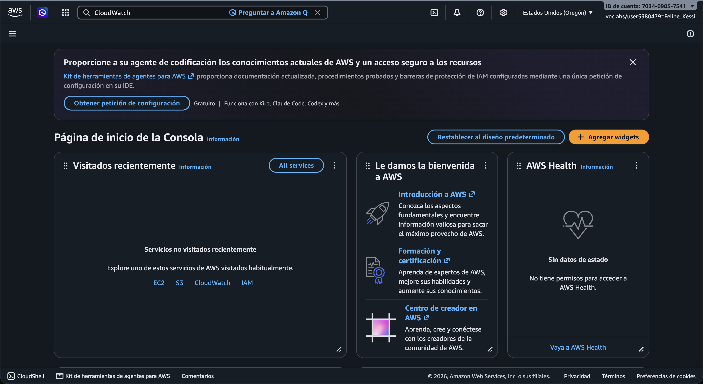

*Captura 8. Búsqueda de CloudWatch desde la consola de AWS.*

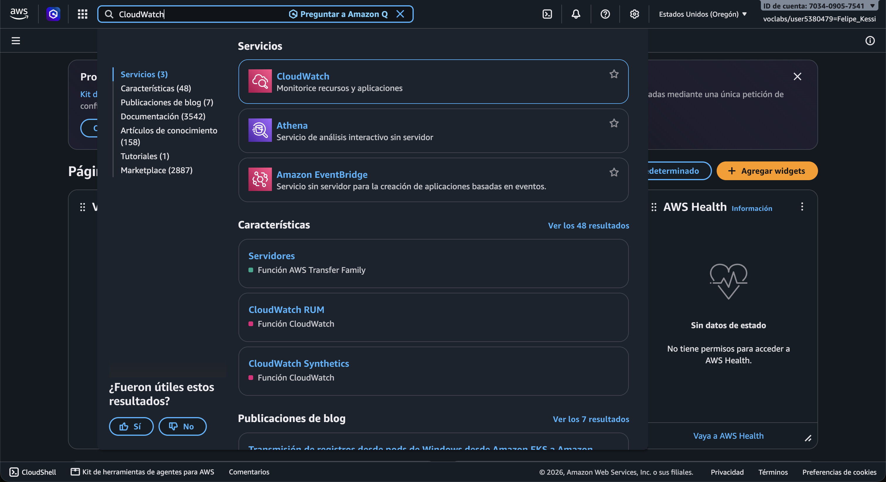

*Captura 9. CloudWatch en los resultados de búsqueda.*

## Abrir el panel automático de EC2

Paso 31. En CloudWatch, se accedió a Paneles y se cambió de Paneles personalizados a Paneles automáticos. Luego se seleccionó EC2.

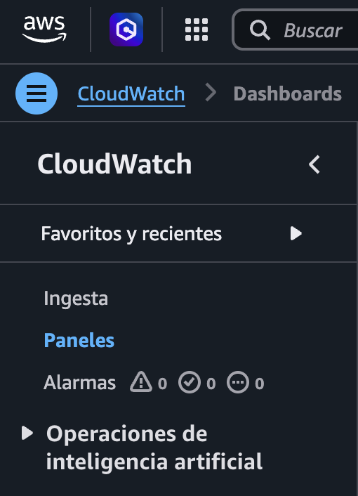

*Captura 10. Opción Paneles en el menú de CloudWatch.*

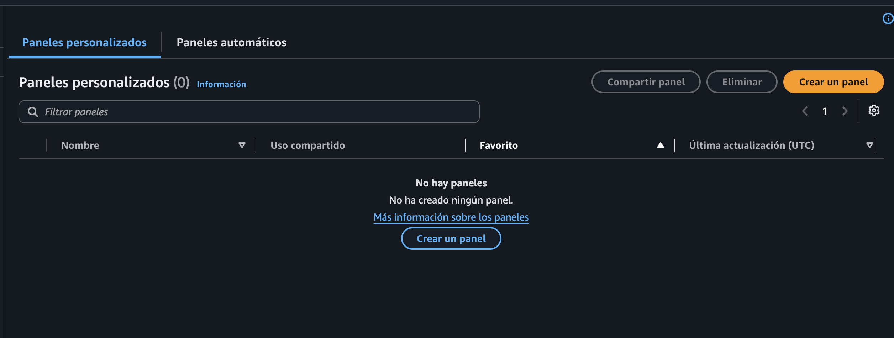

*Captura 11. Vista de Paneles personalizados.*

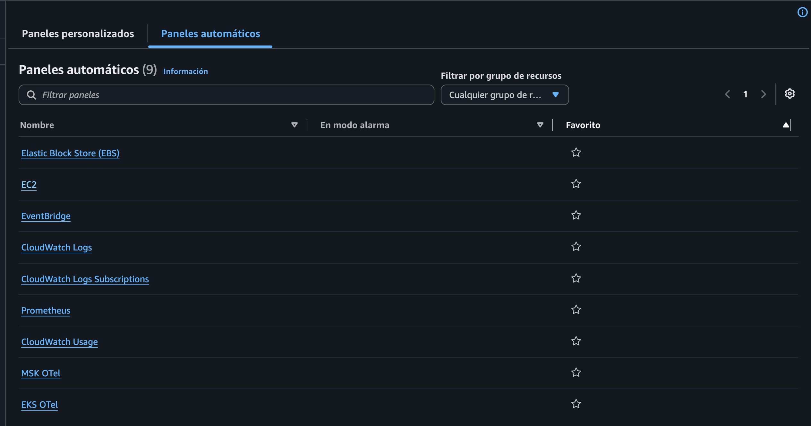

*Captura 12. Paneles automáticos con la opción EC2.*

## Observar las métricas y el descenso de CPU

El panel automático de EC2 mostró CPUUtilization, métricas de disco y métricas de red. En la captura, las métricas de disco indicaron que no había datos disponibles.

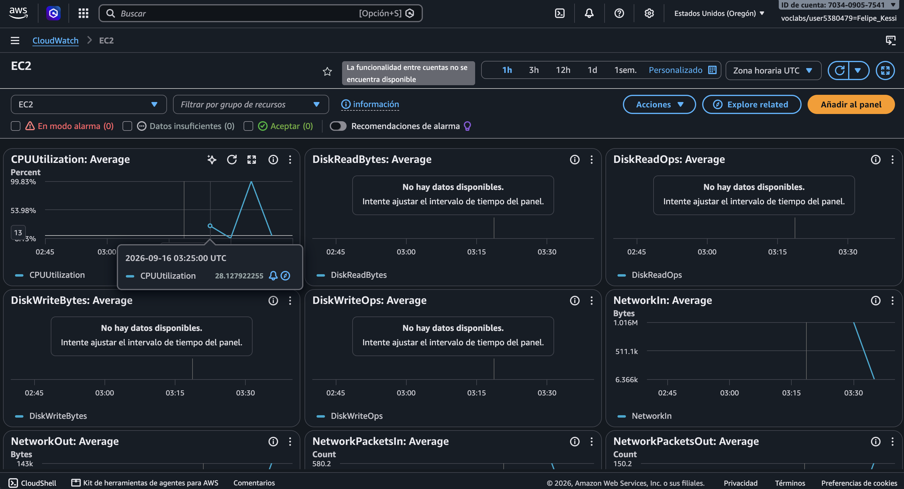

*Captura 13. Panel automático de EC2 con las métricas de supervisión.*

Paso 32. En la revisión posterior, el gráfico mostró un pico cercano a 99,83 % y un descenso hasta aproximadamente 0,15 % de utilización de CPU.

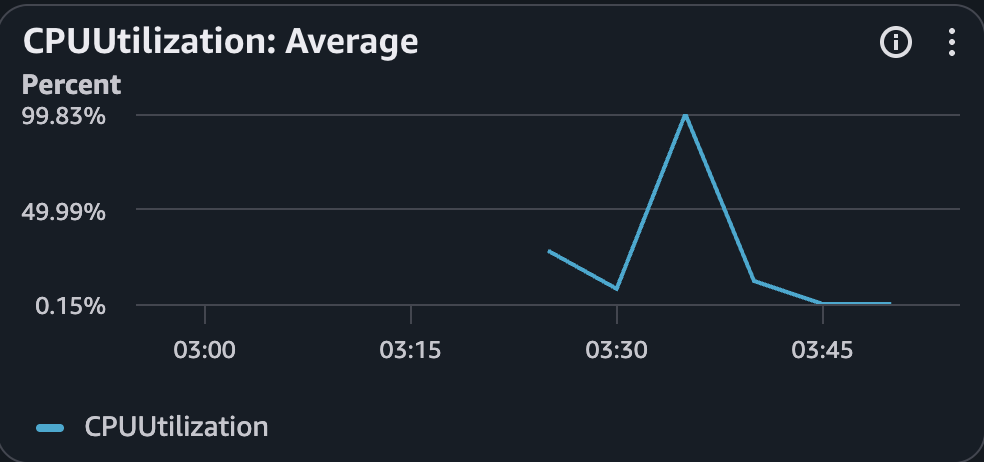

*Captura 14. Pico de CPU y descenso posterior de la utilización.*

## Finalización del laboratorio

Pasos 33–34. La guía indica seleccionar End Lab, confirmar con Yes y cerrar con X el panel cuando aparezca el mensaje “DELETE has been initiated… You may close this message box now”.
