# 243 Administración de Software


**ReCoders® 2026 · Felipe Kessi Bustos**

Módulo Linux · Región us-west-2 · 16 de septiembre de 2026

Felipe Kessi Bustos · ReCoders® 2026

Se consultaron las actualizaciones con yum, se instaló httpd y se deshizo esa instalación. Luego se instaló y configuró AWS CLI y se consultó el tipo de la instancia Command Host.

## Objetivos

• Actualizar la máquina de Linux mediante el administrador de paquetes.

• Recuperar o revertir un paquete previamente actualizado mediante el administrador de paquetes.

• Instalar la Interfaz de la línea de comandos de AWS (AWS CLI).

Duración estimada indicada por la guía: 35 minutos. El entorno restringe el acceso a los servicios y acciones necesarios para el laboratorio.

## Tarea 1 Conexión a Amazon Linux mediante SSH

Pasos 1–4 de la guía. Iniciar el entorno con Start Lab, esperar Lab status: ready y abrir la consola mediante AWS. Estos pasos corresponden a las instrucciones recibidas.

Pasos 13–20. La guía indica descargar labsuser.pem desde Details > Show > Download PEM y obtener PublicIP. En la ejecución se trabajó desde el directorio local keys lab, se ajustaron los permisos de la clave y se inició la conexión SSH.

```bash
chmod 400 labsuser.pem
ssh -i labsuser.pem ec2-user@<public-ip>
```

Se respondió yes a la primera conexión. La terminal mostró Amazon Linux 2 y el prompt de ec2-user.

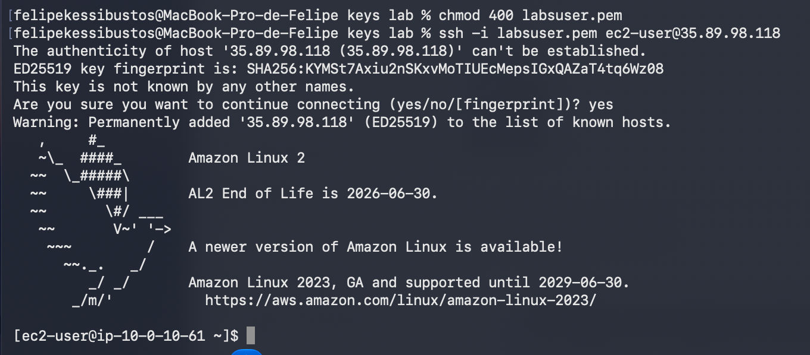

Figura 1. Permisos de la clave y conexión SSH exitosa.

## Tarea 2 Actualización de la máquina Linux

Paso 21. Se consultó la ubicación inicial /home/ec2-user y se cambió al directorio companyA.

```bash
pwd
cd companyA
```

Pasos 22–24. Se consultaron las actualizaciones disponibles y se ejecutaron las actualizaciones de seguridad y de paquetes.

```bash
sudo yum -y check-update
sudo yum update --security
sudo yum -y upgrade
```

La salida indicó que no había paquetes de seguridad disponibles ni paquetes marcados para actualizar.

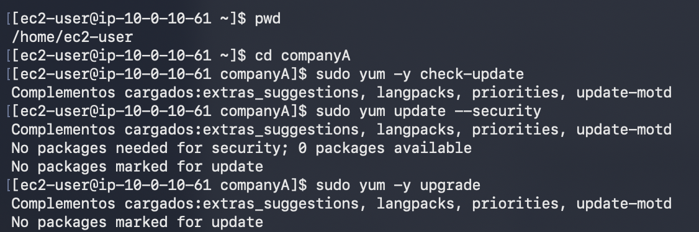

Figura 2. Consulta y actualización sin paquetes pendientes.

Paso 25. Se instaló httpd con yum. La transacción incluyó httpd y 10 dependencias.

```bash
sudo yum install httpd -y
```

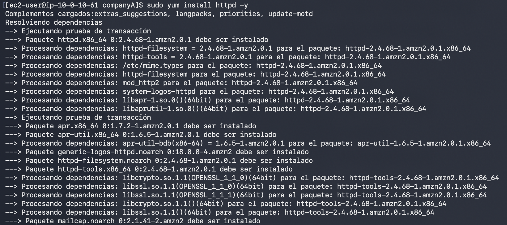

Figura 3. Inicio de la instalación y resolución de dependencias.

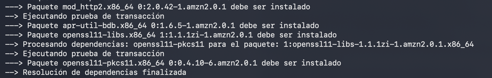

Figura 4. Finalización de la resolución de dependencias.

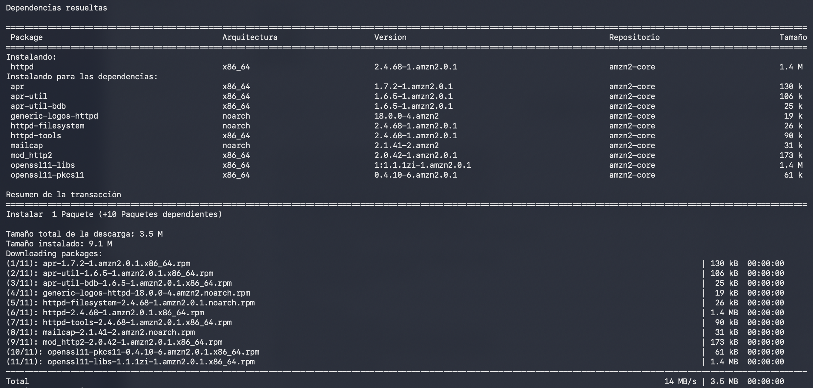

Figura 5. Resumen de 11 paquetes y descarga de 3,5 MB.

La instalación finalizó con ¡Listo! y registró httpd 2.4.68-1.amzn2.0.1.

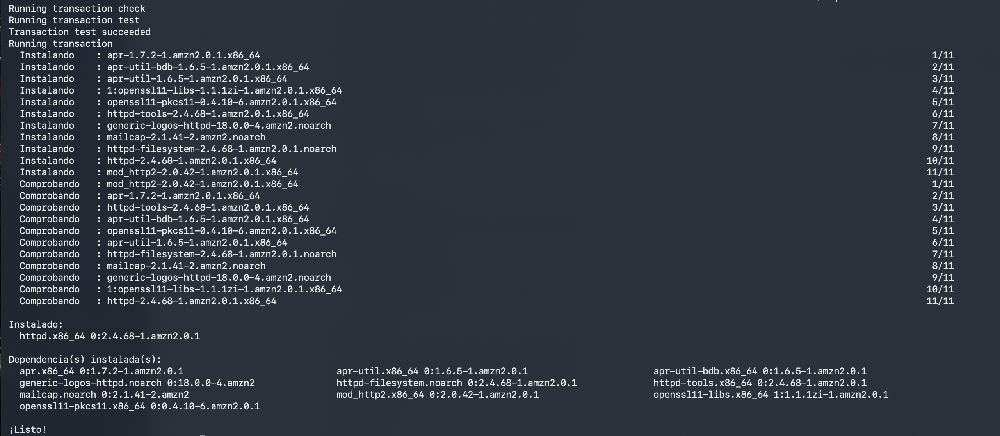

Figura 6. Instalación y comprobación de httpd y sus dependencias.

## Tarea 3 Reversión de la instalación

Pasos 26–27. Se confirmó /home/ec2-user/companyA y se consultó el historial. La transacción de instalación de httpd tenía ID 1 y 11 paquetes modificados.

```bash
pwd
sudo yum history list
```

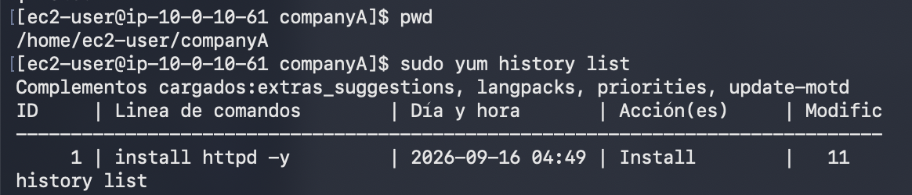

Figura 7. Historial con la transacción 1.

Paso 28. Se revisó el detalle de esa transacción, que mostraba el comando install httpd -y y el resultado Éxito.

```bash
sudo yum history info 1
```

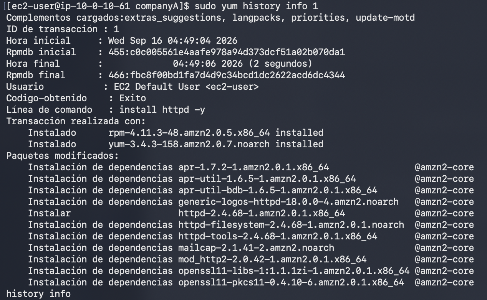

Figura 8. Detalle de la instalación registrada en yum.

Paso 29. Se deshizo la transacción 1.

```bash
sudo yum -y history undo 1
```

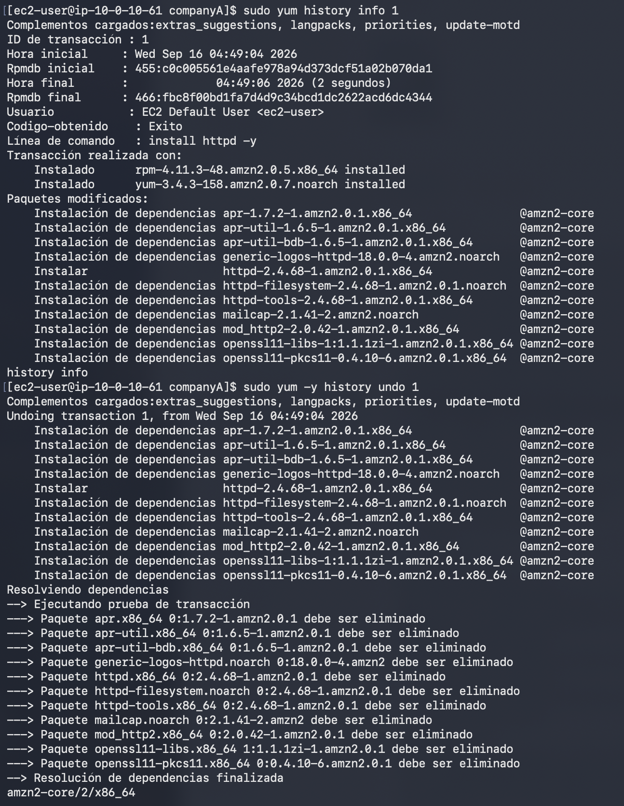

Figura 9. Inicio de la reversión y paquetes seleccionados para eliminar.

La operación eliminó los 11 paquetes instalados en la tarea anterior y terminó con ¡Listo! En esta ejecución se revirtió una instalación; no se observó una degradación a una versión anterior.

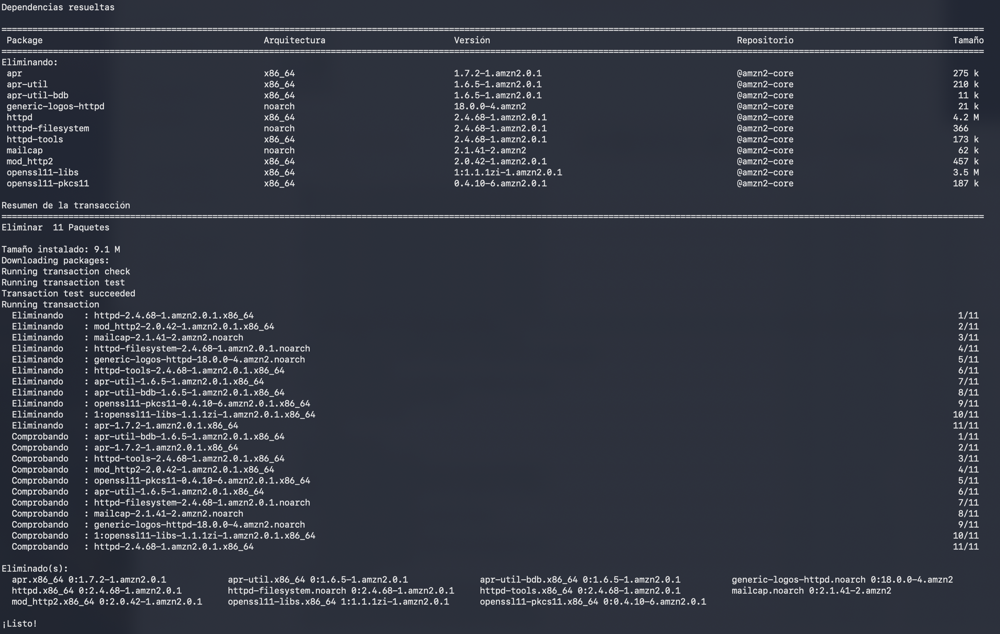

Figura 10. Eliminación completada de httpd y sus dependencias.

## Tarea 4 Instalación de AWS CLI

Pasos 30–31. Se verificaron las versiones disponibles. Python 3.7.16 y pip 20.2.2 ya estaban instalados.

```bash
python3 --version
pip3 --version
```

Paso 32. Se descargó el instalador con el nombre awscliv2.zip en el directorio actual.

```bash
curl "https://awscli.amazonaws.com/awscli-exe-linux-x86_64.zip" -o "awscliv2.zip"
```

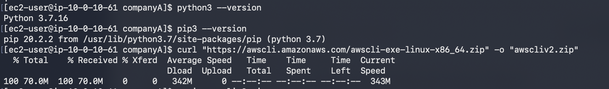

Figura 11. Versiones de Python y pip y descarga del instalador.

Paso 33. Se descomprimió el archivo y se creó el directorio aws.

```bash
unzip awscliv2.zip
```

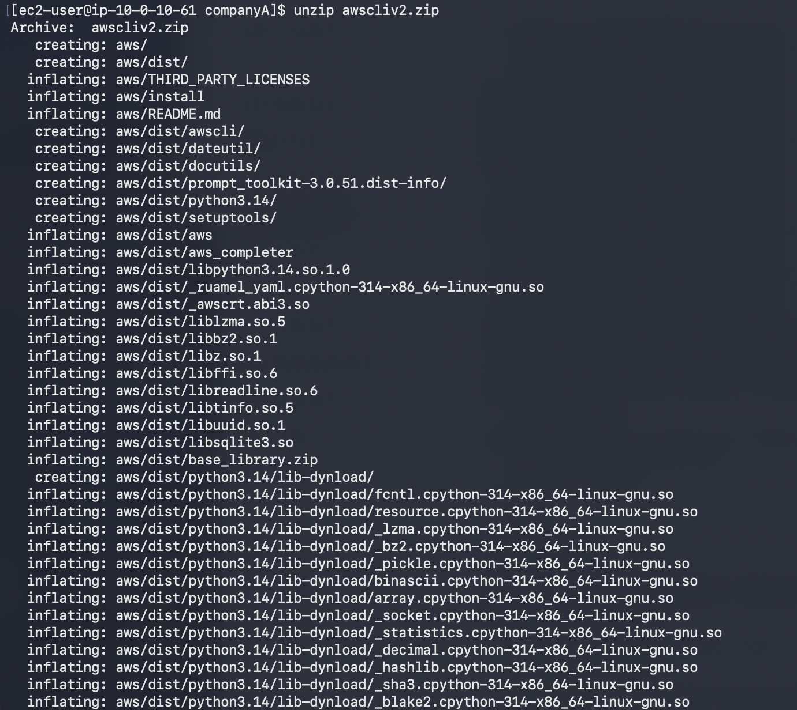

Figura 12. Extracción del instalador de AWS CLI.

Paso 34. Se ejecutó el instalador con permisos de administrador. La salida indicó que ya podía ejecutarse /usr/local/bin/aws --version.

```bash
sudo ./aws/install
```

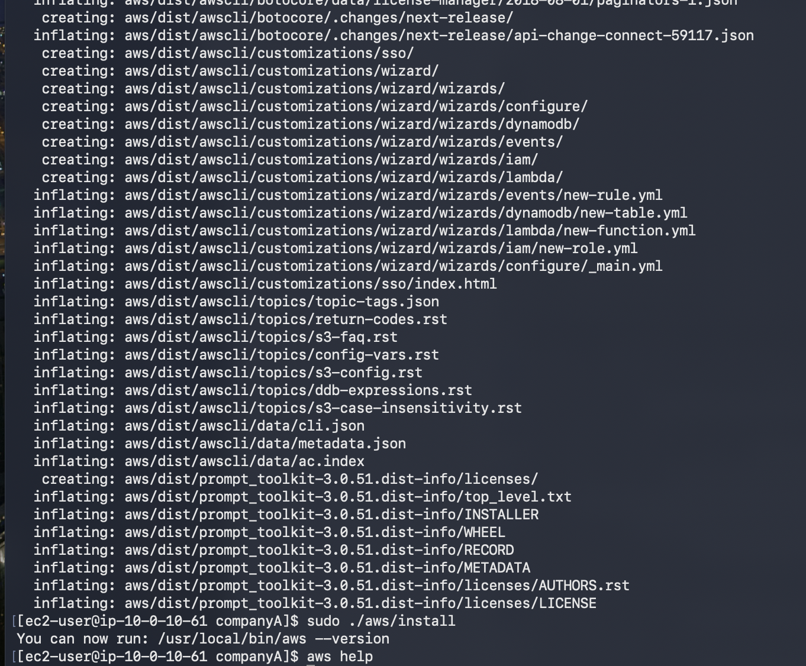

Figura 13. Instalación completada y ejecución de aws help.

Pasos 35–36. Se abrió la ayuda de AWS CLI. La guía indica salir de la ayuda con q.

```bash
aws help
```

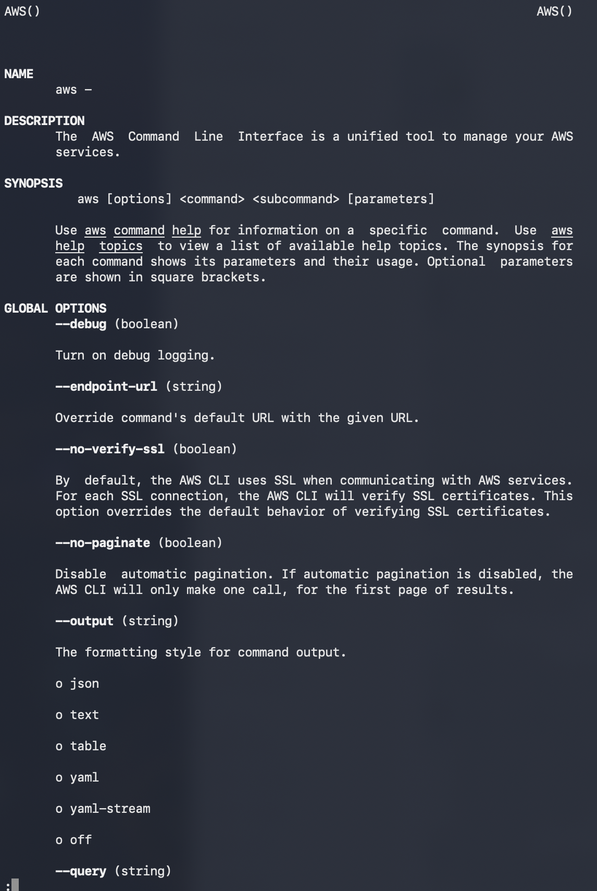

Figura 14. Ayuda de AWS CLI con descripción, sintaxis y opciones.

Pasos 37–38. Se abrió Details > Show y se mostró la sección AWS CLI del panel Credentials para obtener las credenciales temporales de la siguiente tarea.

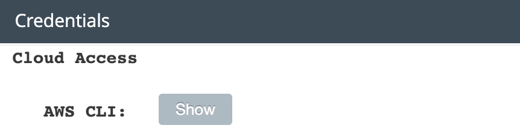

Figura 15. Panel Credentials con la opción Show para AWS CLI.

## Tarea 5 Configuración y consulta de la instancia

Pasos 39–40. Se ejecutó aws configure. En la ejecución se ingresaron las credenciales temporales, el token de sesión y la región us-west-2; también aparece json. La guía indicaba dejar inicialmente vacíos los campos de clave y configurar después el archivo de credenciales.

```bash
aws configure
```

Pasos 41–44. Se abrió ~/.aws/credentials en nano y se incorporó el perfil default con aws_access_key_id, aws_secret_access_key y aws_session_token. La captura muestra la solicitud de guardado en la ruta original. La guía indica guardar con Ctrl+O, confirmar con Intro y salir con Ctrl+X.

```bash
sudo nano ~/.aws/credentials
```

Pasos 45–47. Se accedió a la consola desde AWS y se abrió EC2 > Instancias (en ejecución).


Figura 16. Acceso AWS en la barra del laboratorio.

Paso 48. Se identificó Command Host, en ejecución, con ID i-0fdeb971c73b36475 y tipo t3.micro.

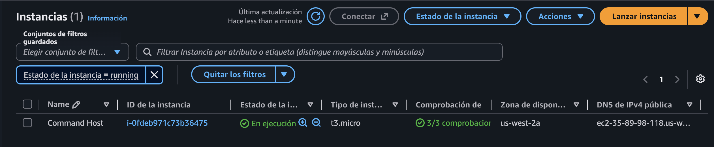

Figura 17. Instancia Command Host en la lista de EC2.

Paso 49. Se consultó el atributo instanceType mediante AWS CLI usando el ID de la instancia.

```bash
aws ec2 describe-instance-attribute \
  --instance-id i-0fdeb971c73b36475 \
  --attribute instanceType
```

La respuesta JSON devolvió el ID consultado y el valor t3.micro, confirmando que la consulta a AWS fue exitosa.

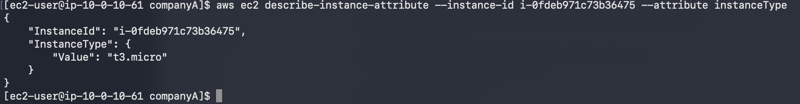

Figura 18. Respuesta JSON con el tipo de instancia t3.micro.

## Cierre de la sesión y del laboratorio

Se ejecutó exit. La terminal mostró logout y confirmó el cierre de la conexión SSH.

```bash
exit
```

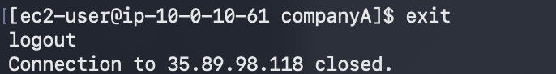

Figura 19. Cierre de la sesión SSH.

Pasos 50–51 de la guía. Seleccionar End Lab, confirmar con Yes y cerrar con X el panel que informa DELETE has been initiated. La evidencia recibida confirma el cierre SSH; la finalización del entorno mediante End Lab queda pendiente de verificar.

## Validación de los resultados

Actualización del sistema: comandos ejecutados; yum informó que no había actualizaciones pendientes.

Reversión: se deshizo la transacción 1 y se eliminaron httpd y sus 10 dependencias.

AWS CLI: instalación realizada y consulta del tipo de instancia completada con respuesta JSON t3.micro.

Limpieza: conexión SSH cerrada. Confirmación de End Lab pendiente de verificar.
