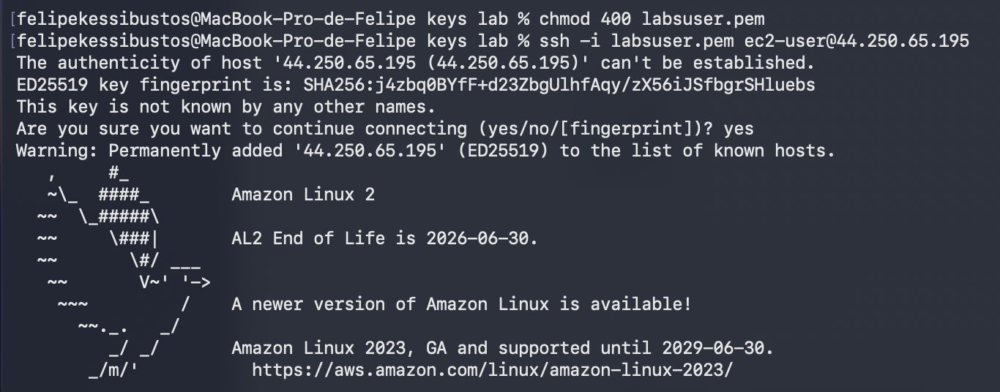
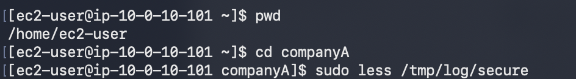
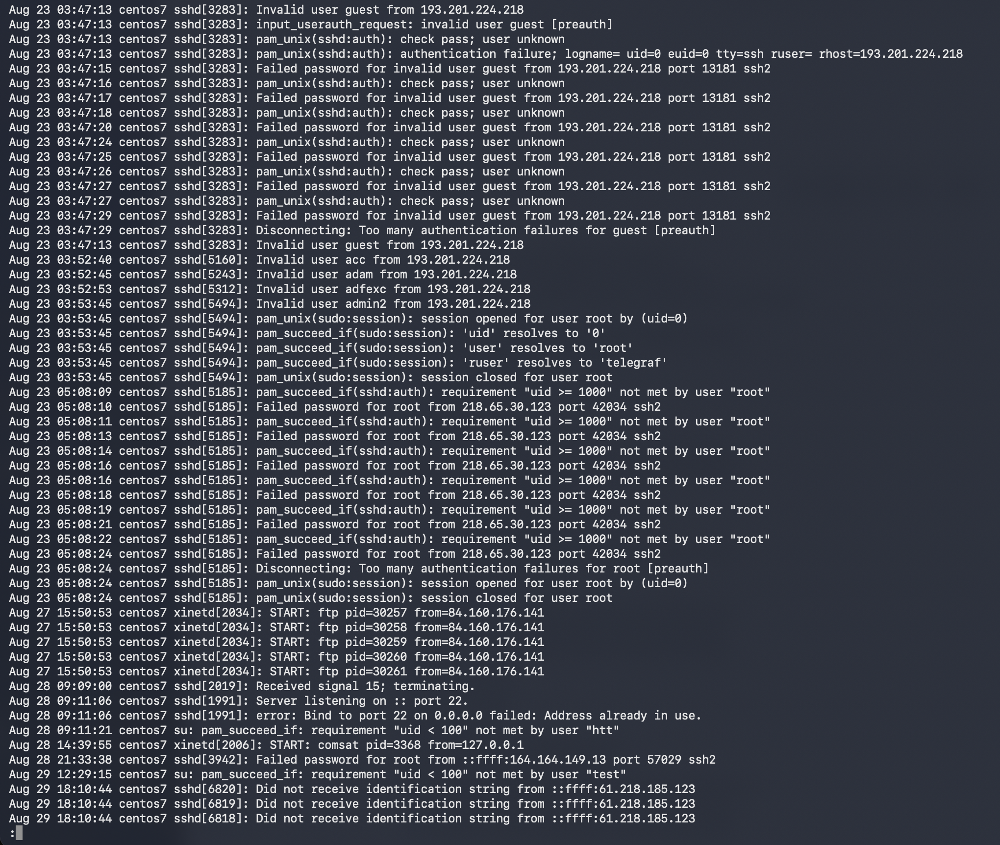
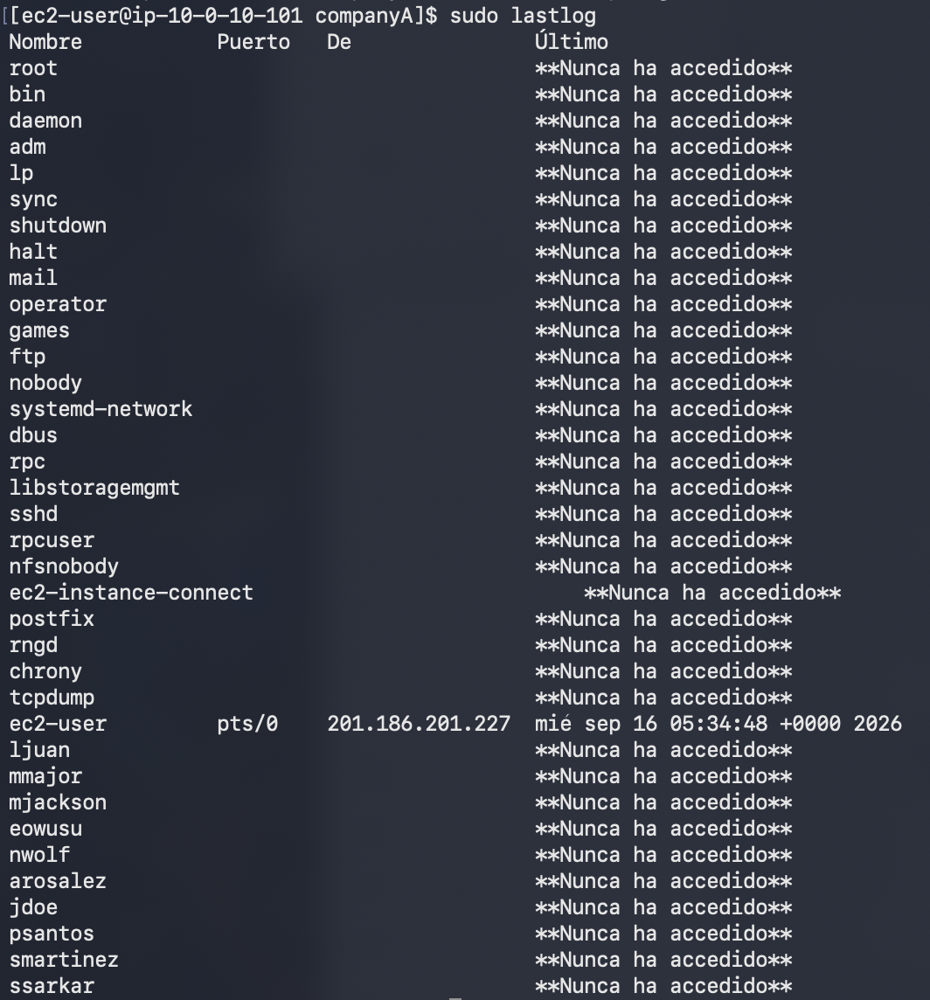

# 245 Administración de Archivos de Registro

**ReCoders® 2026 · Felipe Kessi Bustos**

Módulo: Linux · Región: us-west-2 · Fecha: 16 de septiembre de 2026

Autor: Felipe Kessi Bustos · ReCoders® 2026

## Objetivo

Revisar lastlog y los resultados de registro seguros de la máquina de Linux. Duración estimada de la guía: 5 a 10 minutos.

## Tarea 1 Conexión SSH a Amazon Linux

Pasos 1 a 4 de la guía: seleccionar Start Lab, esperar Lab status: ready, cerrar el panel y abrir AWS. Permitir ventanas emergentes si es necesario y ubicar la consola junto a las instrucciones. El entorno puede restringir el acceso a los servicios y acciones requeridos por el laboratorio.

Pasos 13 a 17 para macOS/Linux: abrir Details > Show, descargar labsuser.pem, anotar PublicIP y cerrar el panel. Abrir el terminal en la carpeta de la clave; la captura muestra la carpeta local keys lab.

Pasos 18 a 20: se ajustaron los permisos de la clave y se inició la conexión SSH:

```bash
chmod 400 labsuser.pem
ssh -i labsuser.pem ec2-user@44.250.65.195
```

Se respondió yes a la confirmación de la primera conexión. El terminal mostró el acceso a Amazon Linux 2.



*Captura 1. Permisos de la clave y conexión SSH a Amazon Linux 2.*

## Tarea 2 Revisión del archivo de registro seguro

Paso 21: se ejecutó pwd; el resultado fue /home/ec2-user. Luego se ingresó a companyA. Paso 22: se abrió el archivo de ejemplo con less.

```bash
pwd
cd companyA
sudo less /tmp/log/secure
```



*Captura 2. Comprobación del directorio y apertura del registro.*

La guía utiliza /tmp/log/secure como archivo de prueba e indica que la ubicación habitual es /var/log/secure.



*Captura 3. Contenido del archivo secure con eventos de autenticación y servicios.*

Se observan intentos fallidos para guest desde 193.201.224.218, puerto 13181, y para root desde 218.65.30.123, puerto 42034; ambos incluyen desconexiones por demasiados fallos de autenticación.

## Tarea 2 Consulta de los últimos inicios de sesión

Paso 23 de la guía: salir de less con q. Paso 24: se ejecutó el siguiente comando para consultar el último inicio de sesión de cada usuario:

```bash
sudo lastlog
```



*Captura 4. Salida de lastlog con el último acceso de ec2-user.*

ec2-user registra un acceso por pts/0 desde 201.186.201.227, el 16 de septiembre de 2026 a las 05:34:48 +0000. Los demás usuarios visibles aparecen como “Nunca ha accedido”.

## Desafío adicional

Pregunta de la guía: ¿Qué información se puede extraer para algunos de los propósitos de su empresa?

Los registros revisados permiten identificar usuarios, direcciones IP de origen, puertos, fechas y horas, fallos de autenticación y desconexiones. Esta información puede apoyar la revisión de accesos y la detección de intentos repetidos. lastlog permite consultar el último acceso registrado de cada usuario y reconocer las cuentas que aparecen como “Nunca ha accedido”.

## Finalización del laboratorio

Pasos 25 y 26 de la guía: seleccionar End Lab y confirmar con Yes. Al aparecer “DELETE has been initiated… You may close this message box now”, cerrar el panel con X.

## Resultados observados

Se accedió a Amazon Linux 2 mediante SSH, se revisó el archivo /tmp/log/secure desde companyA y se consultaron los últimos inicios de sesión mediante sudo lastlog.

## Acerca de Amazon EC2

La guía describe tipos y tamaños de instancia con distintas combinaciones de CPU, memoria, almacenamiento y redes, e identifica t3.micro como la instancia utilizada en el laboratorio.

## Recursos adicionales de la guía

- [Tipos de instancia de Amazon EC2](https://aws.amazon.com/ec2/instance-types)

- [Imágenes de máquina de Amazon AMI](https://docs.aws.amazon.com/AWSEC2/latest/UserGuide/AMIs.html)

- [Comprobaciones de estado de las instancias](https://docs.aws.amazon.com/AWSEC2/latest/UserGuide/monitoring-system-instance-status-check.html)

- [Cuotas de servicio de Amazon EC2](https://docs.aws.amazon.com/AWSEC2/latest/UserGuide/ec2-resource-limits.html)

- [Terminar la instancia](https://docs.aws.amazon.com/AWSEC2/latest/UserGuide/terminating-instances.html)

- [AWS Training and Certification](https://aws.amazon.com/training/)

Referencia: instrucciones del laboratorio proporcionadas por el usuario. © 2024 Amazon Web Services, Inc. y sus filiales.
