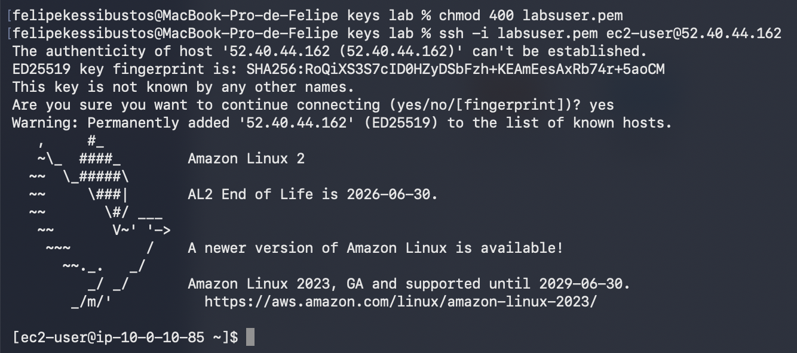
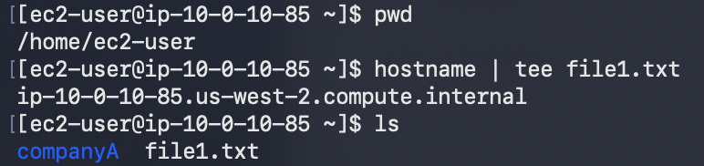
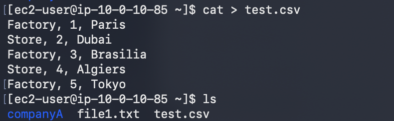
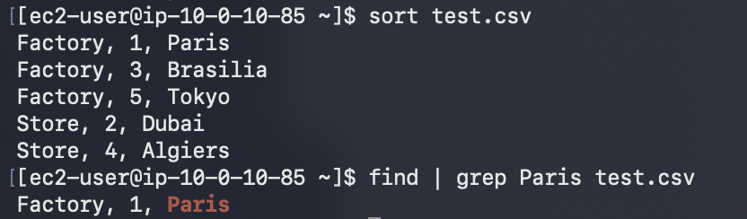
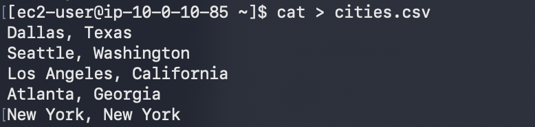
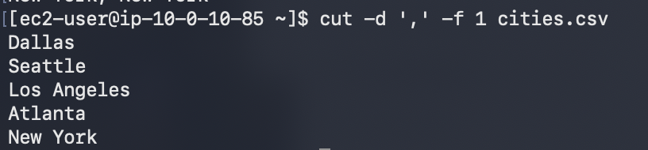
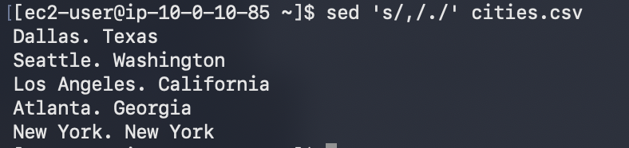
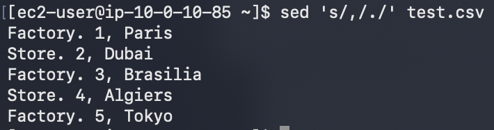

# 247 Trabajo con comandos

Módulo: Linux  |  Región: us-west-2
Fecha: 15 de septiembre de 2026
Autor: Felipe Kessi Bustos
ReCoders® 2026

## Objetivos

Usar tee para dirigir la salida a un archivo; sort para reorganizar la salida de un archivo CSV; cut para extraer campos; sed para sustituir texto; y el operador de barra vertical (|).

Duración estimada indicada en la guía: 30 minutos.

## Acceso al entorno

Las instrucciones indican que las sesiones dependen del material y las sesiones anteriores. El acceso a servicios y acciones de AWS puede estar restringido a lo necesario para el laboratorio.

1. Seleccionar Start Lab y esperar el estado Lab status: ready. Cerrar el panel con la X. Para ampliar el tiempo, la guía indica volver a seleccionar Start Lab.

2. Seleccionar AWS para abrir la consola con inicio de sesión automático. Si el navegador bloquea la ventana, permitir las ventanas emergentes. Ubicar la consola junto a las instrucciones.

3. Para macOS/Linux, abrir Details > Show, descargar labsuser.pem mediante Download PEM, anotar PublicIP y cerrar el panel. Abrir el terminal y ubicarse en el directorio de la clave.

Estos pasos corresponden a las instrucciones de acceso recibidas. La evidencia del terminal comienza con el ajuste de permisos y la conexión SSH.

## Tarea 1 Conexión SSH

4. En el directorio que contiene labsuser.pem, ejecutar los comandos de permisos y conexión. Reemplazar <public-ip> por la PublicIP del entorno.

```bash
chmod 400 labsuser.pem
ssh -i labsuser.pem ec2-user@<public-ip>
```

5. Aceptar la primera conexión con yes. La captura muestra el acceso a Amazon Linux 2 y el prompt de ec2-user.



*Evidencia 1. Permisos de la clave y conexión SSH a Amazon Linux 2.*

## Tarea 2 Utilizar tee

6. Confirmar el directorio, ejecutar hostname con tee y listar los archivos.

```bash
pwd
hostname | tee file1.txt
ls
```



*Evidencia 2. Directorio /home/ec2-user, salida de hostname y presencia de file1.txt.*

Resultado observado: hostname muestra ip-10-0-10-85.us-west-2.compute.internal. tee dirige la salida a pantalla y a file1.txt; ls muestra companyA y file1.txt.

## Tarea 3 Utilizar sort y el operador pipe

7. La guía indica confirmar /home/ec2-user con pwd. Crear test.csv con cat, ingresar los cinco registros y finalizar con Ctrl+D.

```bash
cat > test.csv
Factory, 1, Paris
Store, 2, Dubai
Factory, 3, Brasilia
Store, 4, Algiers
Factory, 5, Tokyo
```

8. Ejecutar ls para verificar la presencia de test.csv.



*Evidencia 3. Creación de test.csv y verificación mediante ls.*

9. Ordenar la salida del archivo y ejecutar la búsqueda de Paris indicada en la guía.

```bash
sort test.csv
find | grep Paris test.csv
```



*Evidencia 4. Salida ordenada de test.csv y coincidencia Factory, 1, Paris.*

Resultado observado: sort muestra Factory 1, 3 y 5, seguidos por Store 2 y 4. La búsqueda devuelve Factory, 1, Paris. En el comando utilizado, grep busca directamente en test.csv, porque el archivo se entrega como argumento.

## Tarea 4 Utilizar cut

10. La guía indica confirmar /home/ec2-user con pwd. Crear cities.csv, ingresar las cinco líneas y finalizar con Ctrl+D.

```bash
cat > cities.csv
Dallas, Texas
Seattle, Washington
Los Angeles, California
Atlanta, Georgia
New York, New York
```



*Evidencia 5. Ingreso de las cinco ciudades y sus estados en cities.csv.*

11. Extraer el primer campo de cada línea, usando la coma como delimitador.

```bash
cut -d ',' -f 1 cities.csv
```



*Evidencia 6. Salida de cut con Dallas, Seattle, Los Angeles, Atlanta y New York.*

La opción -d define el delimitador y -f 1 selecciona el primer campo. La salida contiene los nombres de las ciudades; el comando no modifica el archivo original.

## Uso de sed

12. Ejecutar la sustitución de la primera coma por un punto en cada línea de cities.csv.

```bash
sed 's/,/./' cities.csv
```



*Evidencia 7. Salida de sed sobre cities.csv con puntos entre ciudad y estado.*

Resultado observado: Dallas. Texas; Seattle. Washington; Los Angeles. California; Atlanta. Georgia; New York. New York.

13. Ejecutar la misma sustitución sobre test.csv.

```bash
sed 's/,/./' test.csv
```



*Evidencia 8. Salida de sed sobre test.csv con la primera coma sustituida por un punto.*

Resultado observado: Factory. 1, Paris; Store. 2, Dubai; Factory. 3, Brasilia; Store. 4, Algiers; Factory. 5, Tokyo. La segunda coma de cada línea permanece. Ambos comandos muestran el resultado en pantalla sin modificar los archivos originales.

## Resultados documentados

Las capturas registran la conexión SSH, la creación de file1.txt, test.csv y cities.csv, y las salidas de tee, sort, cut, sed y la búsqueda con el comando que incluye |.
