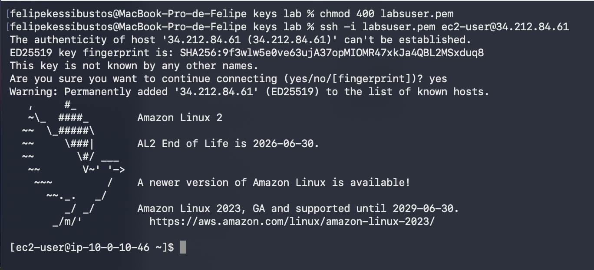
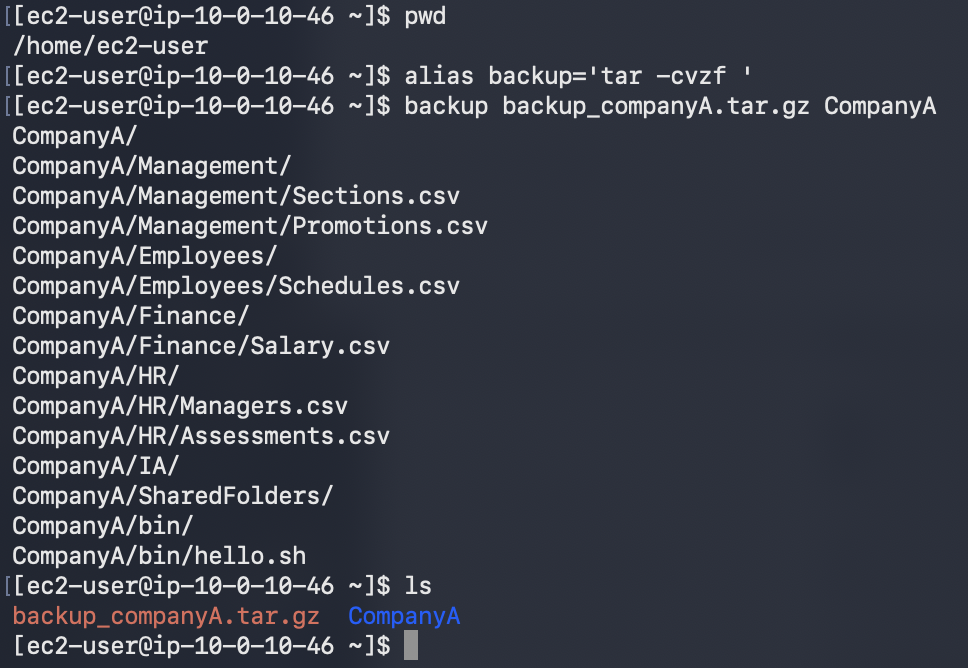
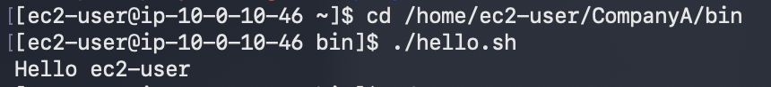
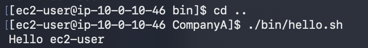
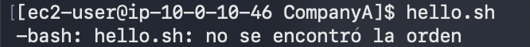
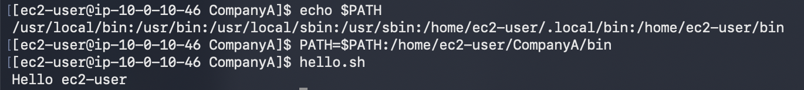

# 249 El intérprete de comandos Bash

**ReCoders® 2026 · Felipe Kessi Bustos**

Módulo: Linux · Región: us-west-2 · Fecha: 16 de septiembre de 2026

Autor: Felipe Kessi Bustos · ReCoders® 2026

## Objetivos

Crear y utilizar un alias para respaldar una carpeta completa. Explorar la variable PATH y agregar un directorio para ejecutar un script por su nombre. Duración estimada: 30 minutos.

## Tarea 1 Conexión a Amazon Linux mediante SSH

Pasos 1 a 4 de la guía: seleccionar Start Lab, esperar Lab status: ready, cerrar el panel y abrir AWS. Si es necesario, permitir ventanas emergentes. El entorno puede restringir los servicios y acciones a los requeridos por el laboratorio.

Pasos 13 a 17 para macOS/Linux: abrir Details > Show, descargar labsuser.pem, anotar PublicIP y cerrar el panel. Abrir el terminal en la carpeta de la clave. La captura muestra la carpeta local keys lab.

Pasos 18 a 20: se establecieron los permisos de la clave y se inició la conexión:

```bash
chmod 400 labsuser.pem
ssh -i labsuser.pem ec2-user@34.212.84.61
```

Se respondió yes a la primera conexión. Se accedió a Amazon Linux 2 como ec2-user en ip-10-0-10-46.



*Captura 1. Permisos de la clave y acceso SSH a la instancia.*

## Tarea 2 Crear un alias para respaldar CompanyA

Paso 21: se comprobó el directorio de trabajo con pwd. El resultado fue /home/ec2-user.

```bash
pwd
```

Paso 22: se creó el alias backup para ejecutar tar con compresión gzip y mostrar los archivos incluidos:

```bash
alias backup='tar -cvzf '
```

Paso 23: se utilizó el alias con el nombre del archivo de destino como primer argumento y la carpeta de origen como segundo argumento:

```bash
backup backup_companyA.tar.gz CompanyA
```

Paso 24: se verificó la creación del respaldo con ls. La salida mostró backup_companyA.tar.gz y CompanyA.

```bash
ls
```



*Captura 2. Creación del alias, respaldo de CompanyA y verificación del archivo.*

## Tarea 3 Ejecutar el script mediante su ruta

Pasos 25 y 26: se ingresó al directorio bin de CompanyA y se ejecutó el script hello.sh desde esa ubicación:

```bash
cd /home/ec2-user/CompanyA/bin
./hello.sh
```

El script devolvió Hello ec2-user.



*Captura 3. Ejecución de ./hello.sh desde CompanyA/bin.*

Pasos 27 y 28: se regresó al directorio CompanyA y se ejecutó el script mediante la ruta relativa ./bin/hello.sh:

```bash
cd ..
./bin/hello.sh
```

El resultado fue nuevamente Hello ec2-user.



*Captura 4. Ejecución del script desde el directorio CompanyA.*

Paso 29: se intentó ejecutar el script únicamente por su nombre:

```bash
hello.sh
```

El terminal respondió: -bash: hello.sh: no se encontró la orden.



*Captura 5. Intento de ejecución por nombre antes de modificar PATH.*

## Tarea 3 Consultar y actualizar PATH

Paso 30: se consultó el valor de PATH:

```bash
echo $PATH
```

La salida incluía /usr/local/bin, /usr/bin, /usr/local/sbin, /usr/sbin, /home/ec2-user/.local/bin y /home/ec2-user/bin. No incluía /home/ec2-user/CompanyA/bin, donde estaba hello.sh.

Paso 31: se agregó el directorio del script al final del valor existente:

```bash
PATH=$PATH:/home/ec2-user/CompanyA/bin
```

Paso 32: se ejecutó hello.sh desde CompanyA sin indicar su ruta. Esta vez el resultado fue Hello ec2-user.

```bash
hello.sh
```



*Captura 6. Consulta de PATH, incorporación de CompanyA/bin y ejecución exitosa.*

## Finalización del laboratorio

Pasos 33 y 34 de la guía: seleccionar End Lab y confirmar con Yes. Cuando aparezca el mensaje “DELETE has been initiated… You may close this message box now”, cerrar el panel con X.

## Resultados observados

Se creó y verificó backup_companyA.tar.gz mediante el alias backup. Se ejecutó hello.sh mediante rutas relativas y, después de agregar /home/ec2-user/CompanyA/bin a PATH, también por su nombre.
