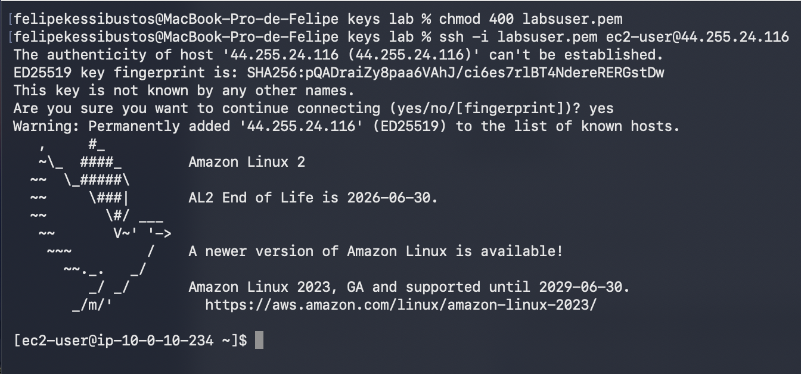
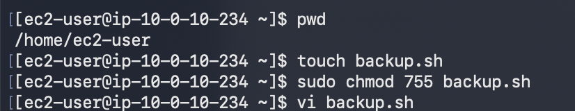
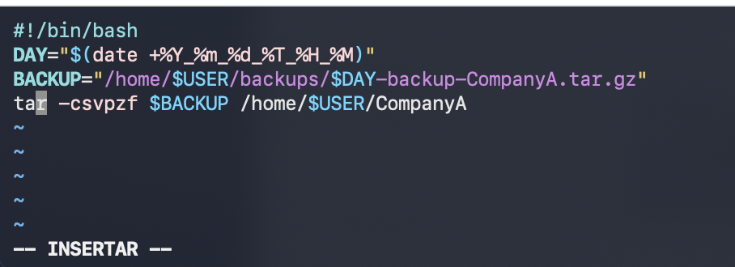
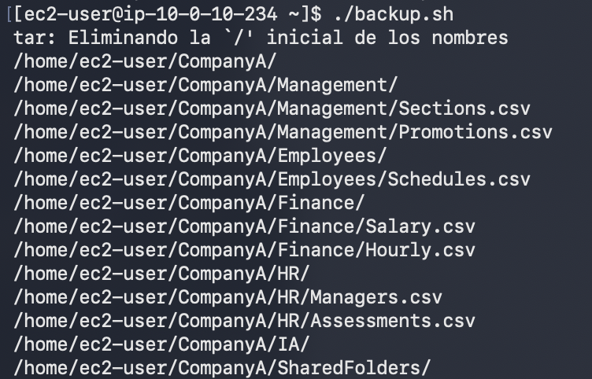
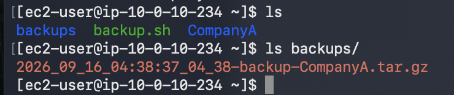
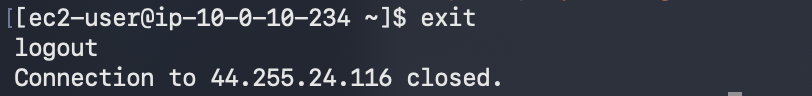

# Bash Shell Scripts

Módulo: Linux  |  Región: us-west-2  |  Fecha: 16 de septiembre de 2026

Autor: Felipe Kessi Bustos  |  ReCoders® 2026

Objetivo: crear un script de Bash que automatice el respaldo de una carpeta. Duración estimada según la guía: 25 minutos.

## 1 Conexión a Amazon Linux mediante SSH

La guía indica iniciar el entorno con Start Lab, esperar “Lab status: ready”, abrir AWS y obtener labsuser.pem y PublicIP desde Details > Show. La evidencia recibida comienza en el terminal de macOS.

Se restringieron los permisos de la clave y se inició la conexión SSH. Se respondió yes a la confirmación de la primera conexión.

```bash
chmod 400 labsuser.pem
ssh -i labsuser.pem ec2-user@<public-ip>
```



Evidencia 1. Conexión exitosa a Amazon Linux 2 como ec2-user.

## 2 Creación del archivo ejecutable

Se comprobó el directorio de trabajo /home/ec2-user, se creó backup.sh, se aplicaron permisos 755 y se abrió el archivo con vi.

```bash
pwd
touch backup.sh
sudo chmod 755 backup.sh
vi backup.sh
```



Evidencia 2. Directorio de trabajo, creación, permisos y apertura de backup.sh.

## 3 Contenido del script de respaldo

En el modo insertar de vi se escribió el siguiente contenido. DAY guarda la fecha y hora; BACKUP define la ruta del archivo comprimido de CompanyA.

```bash
#!/bin/bash
DAY="$(date +%Y_%m_%d_%T_%H_%M)"
BACKUP="/home/$USER/backups/$DAY-backup-CompanyA.tar.gz"
tar -csvpzf $BACKUP /home/$USER/CompanyA
```



Evidencia 3. Contenido de backup.sh en el editor vi.

La guía indica guardar y salir con Esc, :wq e Intro. La ejecución posterior evidencia que el script quedó disponible para ejecutarse.

## 4 Ejecución del respaldo

Se ejecutó el script desde el directorio de inicio.

```bash
./backup.sh
```



Evidencia 4. Salida de tar al procesar la carpeta CompanyA y sus archivos.

La salida muestra el mensaje “tar: Eliminando la ‘/’ inicial de los nombres” y enumera Management, Employees, Finance, HR, IA y SharedFolders. Entre los archivos visibles están Sections.csv, Promotions.csv, Schedules.csv, Salary.csv, Hourly.csv, Managers.csv y Assessments.csv.

## 5 Verificación del archivo generado

```bash
ls
ls backups/
```



Evidencia 5. Archivo comprimido presente en el directorio backups.

Archivo observado: 2026_09_16_04:38:37_04_38-backup-CompanyA.tar.gz.

## 6 Cierre de la conexión SSH

Se ejecutó exit. El terminal mostró logout y confirmó el cierre de la conexión remota.

```bash
exit
```



Evidencia 6. Cierre de la sesión SSH.

## Validación final

El script backup.sh fue creado y ejecutado. La salida enumeró el contenido de CompanyA y ls backups/ confirmó la presencia del archivo .tar.gz. Las capturas no muestran una prueba de restauración del respaldo.

## Observaciones de la guía

En el fragmento 2, el paso 27 utiliza fecha y hora, mientras que el bloque de ejemplo posterior muestra solo la fecha. El script de esta documentación reproduce la variante con fecha y hora visible en la captura y en el archivo generado.

No se muestran errores que impidan generar el respaldo. La guía menciona cron como una posibilidad para programarlo; no se documenta una configuración de cron en esta ejecución.

## Cleanup Limpieza

La guía indica seleccionar End Lab, confirmar con Yes y cerrar el panel tras el mensaje “DELETE has been initiated…”. Este cierre del entorno queda pendiente de verificar. La evidencia 6 confirma únicamente el cierre de SSH.

## Fuentes y evidencias

Fuentes: dos fragmentos de instrucciones del laboratorio y seis capturas de pantalla aportadas durante la ejecución. Las evidencias están insertadas junto a los pasos que documentan.

