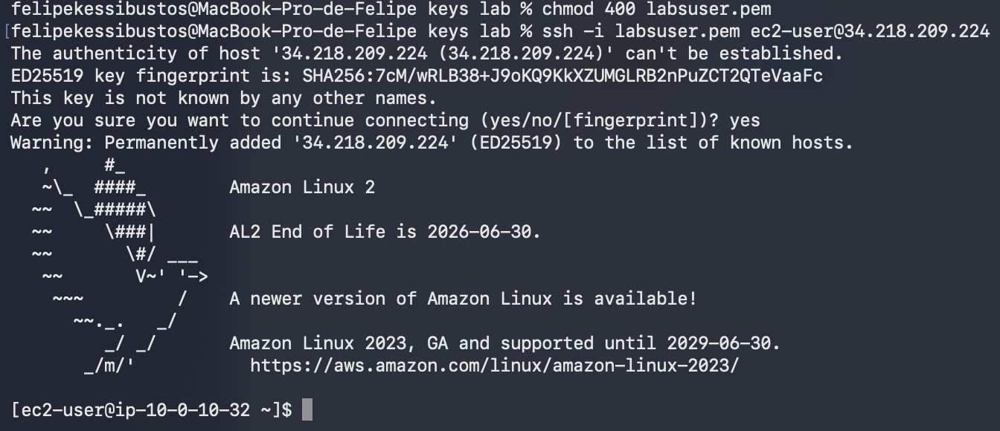
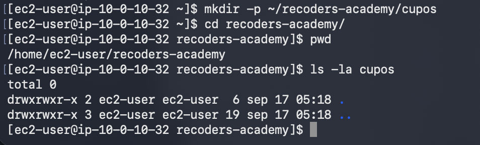
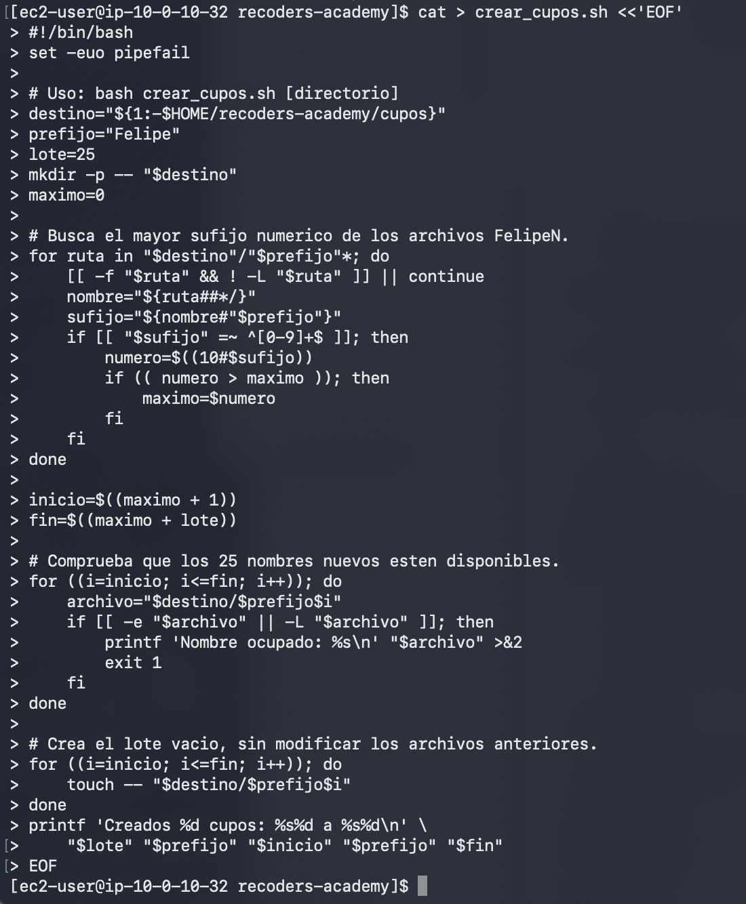
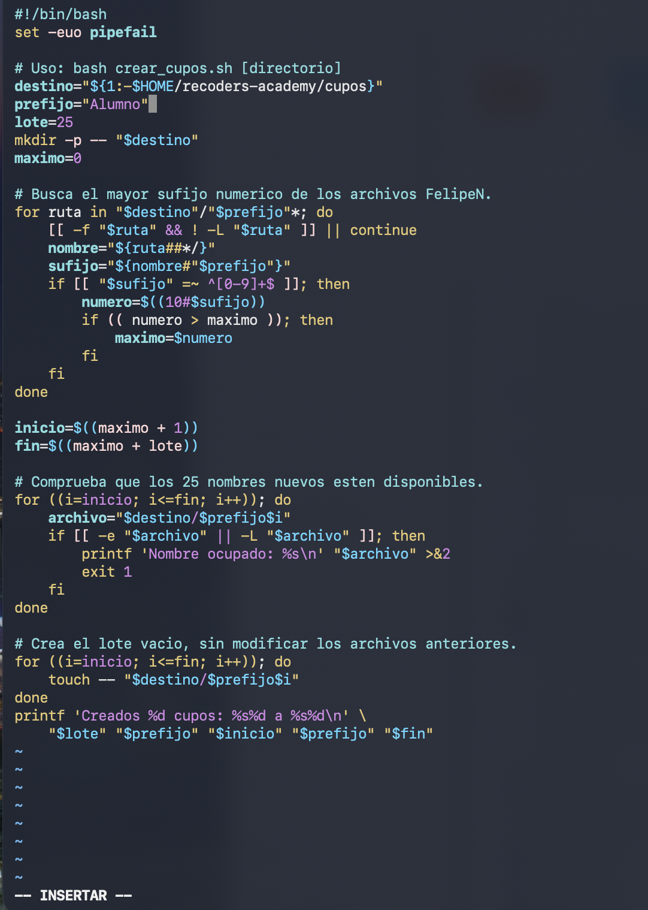
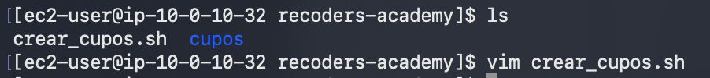
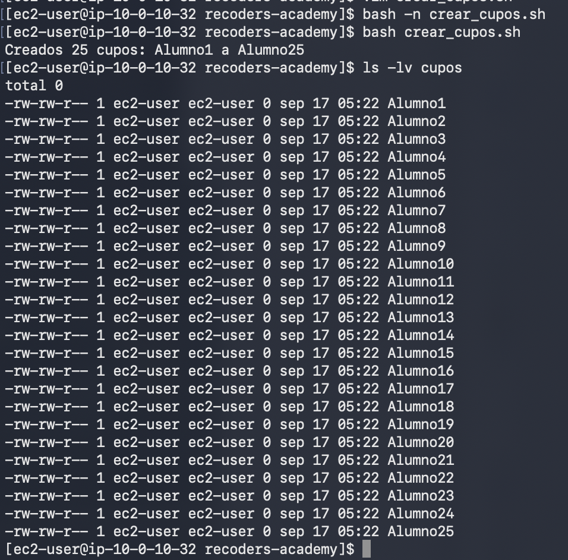
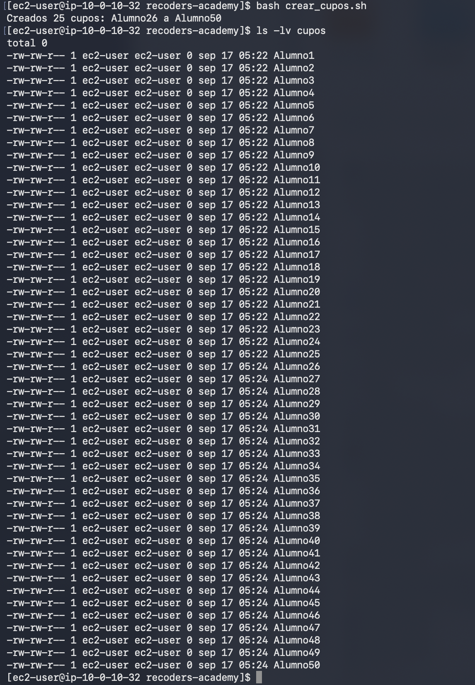
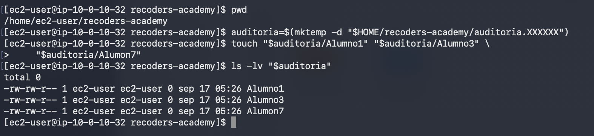
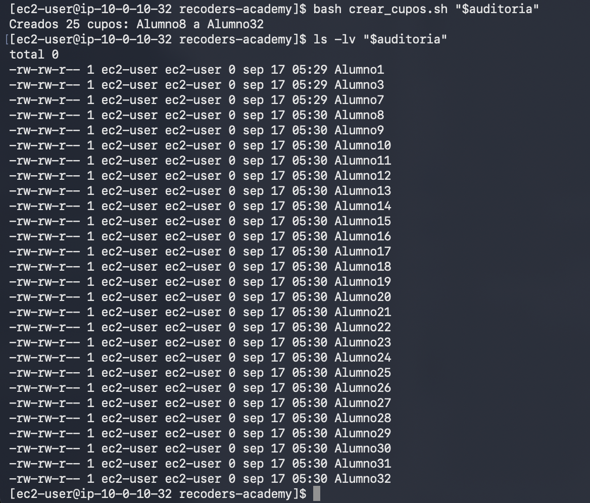
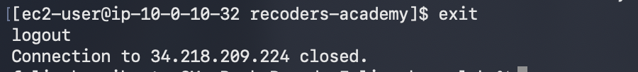

[Volver al README](README.md)


# Laboratorio ReCoders Academy resuelto

Felipe Kessi Bustos • ReCoders® 2026 • 17 de septiembre de 2026

Automaticé la creación de cupos simbólicos para una academia online mediante un script Bash. Creé una primera cohorte de 25 archivos y una segunda que elevó el total a 50. En una prueba separada, continué desde el número máximo 7 y obtuve 28 archivos vacíos en total.

### 1 Conexión a la instancia

En la terminal local cambié los permisos de labsuser.pem con chmod 400 y me conecté como ec2-user mediante SSH. Confirmé la primera conexión con yes. La terminal mostró Amazon Linux 2 y el prompt de la instancia.


*Evidencia 1. Permisos de la clave y conexión SSH a Amazon Linux 2.*

### 2 Preparación del directorio

Creé ~/recoders-academy/cupos, entré en recoders-academy y comprobé la ruta con pwd. La lista inicial de cupos mostró únicamente las entradas . y .., sin archivos de estudiantes.


*Evidencia 2. Directorio /home/ec2-user/recoders-academy y cupos vacío.*

## 3 Creación del script inicial

Creé crear_cupos.sh con cat > crear_cupos.sh <<'EOF'. Pegué el código y cerré la entrada con EOF. Esta primera versión todavía contenía prefijo="Felipe"; posteriormente lo cambié a Alumno antes de las ejecuciones documentadas.


*Evidencia 3. Escritura completa de la primera versión del script.*

## 4 Cambio del prefijo a Alumno

Modifiqué la variable a prefijo="Alumno" en Vim. El comentario de búsqueda conservó la referencia a FelipeN, pero la lógica usa la variable prefijo. Las ejecuciones posteriores confirmaron la creación de nombres AlumnoN.


*Evidencia 4. Código con el prefijo Alumno y lote de 25.*

## 5 Revisión y primera cohorte

La terminal mostró crear_cupos.sh junto al directorio cupos y una apertura del archivo con vim. Después ejecuté bash -n crear_cupos.sh; no apareció un mensaje de error de sintaxis.


*Evidencia 5. Archivo disponible y apertura con Vim.*

Ejecuté bash crear_cupos.sh sin argumentos. El script usó su destino predeterminado y anunció Alumno1 a Alumno25. La lista larga mostró los 25 archivos con tamaño 0 bytes.


*Evidencia 6. Revisión de sintaxis, primera ejecución y lista Alumno1 a Alumno25.*


*Evidencia 7. Conteo de 25 y búsqueda sin resultados de archivos no vacíos.*

## 6 Segunda cohorte

Volví a ejecutar bash crear_cupos.sh. Se creó el lote Alumno26 a Alumno50. La lista mostró los archivos de ambas cohortes, con tamaño 0 bytes.


*Evidencia 8. Segunda ejecución y lista completa de Alumno1 a Alumno50.*

## 7 Verificación y preparación de la auditoría

Conté los archivos regulares de cupos con find y wc -l. Obtuve 50. La búsqueda de archivos con tamaño distinto de 0 bytes no mostró resultados.

```bash
find cupos -maxdepth 1 -type f | wc -l
find cupos -maxdepth 1 -type f ! -size 0c -print
```


*Evidencia 9. Total de 50 archivos, sin archivos no vacíos.*

### Prueba en un directorio independiente

Comprobé mi ubicación con pwd y creé un directorio de auditoría mediante mktemp. La variable auditoria guardó la ruta del directorio, que apareció como auditoria.vKdbRZ. Preparé tres archivos vacíos: Alumno1, Alumno3 y Alumno7.

```bash
auditoria=$(mktemp -d "$HOME/recoders-academy/auditoria.XXXXXX")
touch "$auditoria/Alumno1" "$auditoria/Alumno3" \
    "$auditoria/Alumno7"
ls -lv "$auditoria"
```


*Evidencia 10. Preparación de la auditoría con sufijos 1, 3 y 7.*

Esta preparación dejó tres archivos, pero el número máximo era 7. El siguiente lote debía comenzar en 8 para continuar desde el máximo y no desde la cantidad de archivos.

### Preparación registrada en una captura anterior

También registré una preparación de auditoría con Alumno1, Alumno3 y Alumno7 en la captura de las 2.27.00. Ambas capturas muestran la misma condición inicial; no se documenta aquí una ejecución adicional del script.


*Evidencia 13. Preparación anterior de la prueba con números faltantes.*

## 8 Ejecución y resultado de la auditoría

Ejecuté bash crear_cupos.sh "$auditoria". El script anunció la creación de Alumno8 a Alumno32. La lista conservó Alumno1, Alumno3 y Alumno7, y mostró los 25 archivos nuevos con tamaño 0 bytes.


*Evidencia 11. Lote Alumno8 a Alumno32 en el directorio de auditoría.*

Verifiqué un total de 28 archivos. La búsqueda de archivos no vacíos no produjo resultados. Los números faltantes anteriores a 7 no se rellenaron.


*Evidencia 12. Conteo de 28 y comprobación de archivos vacíos.*

## 9 Resultados del desafío

Las comprobaciones realizadas mostraron que el script agregó lotes de 25 archivos vacíos y continuó la numeración desde el máximo existente. La prueba con saltos permitió distinguir el máximo de la cantidad de archivos.

| Prueba | Resultado observado | Evidencia |
| --- | --- | --- |
| Primera cohorte | Alumno1 a Alumno25; 25 archivos de 0 bytes | 6 y 7 |
| Segunda cohorte | Alumno26 a Alumno50; total 50, todos vacíos | 8 y 9 |
| Auditoría | Alumno8 a Alumno32; total 28, todos vacíos | 10 a 12 |

### Funcionamiento del código utilizado

El script toma un destino opcional y usa ~/recoders-academy/cupos cuando no se proporciona uno. Recorre archivos que comienzan con Alumno, extrae el sufijo numérico y conserva el mayor valor. Calcula inicio = máximo + 1 y fin = máximo + 25.

Antes de crear el lote, comprueba que los nombres nuevos estén disponibles. Después usa touch para generar los archivos y printf para informar el rango. El código admite un destino diferente, como se hizo con la variable auditoria.

### Cambio observado durante la preparación

La primera captura del código tenía Felipe como prefijo. La captura de Vim muestra el cambio a Alumno, y las tres ejecuciones muestran ese prefijo en los nombres generados. El comentario que todavía dice FelipeN no interviene en la ejecución.

### 10 Cierre de la conexión SSH

Al terminar las comprobaciones ejecuté exit. La terminal mostró logout y confirmó que la conexión con la instancia se había cerrado.


*Evidencia 14. Salida de la sesión remota mediante exit.*
