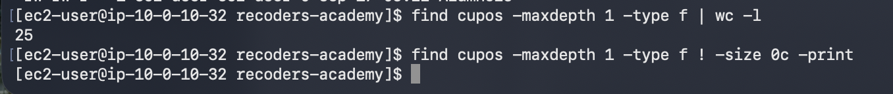
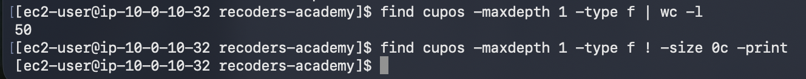
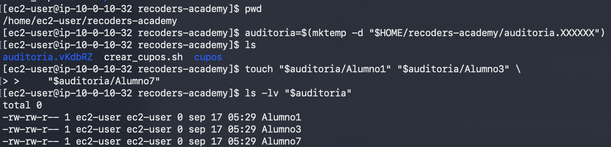
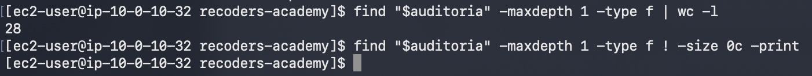

[Volver al README](README.md)


# Guía docente de ReCoders Academy

Felipe Kessi Bustos • ReCoders® 2026

Esta guía permite conducir el desafío de automatización Bash con la narrativa de una academia online y tres puertas de un escape room. Use la guía del estudiante para la actividad y el informe resuelto como referencia de evidencias. El código de solución se reserva para la revisión docente o la puesta en común final.

### Propósito de aprendizaje

Al finalizar, el estudiante debe poder crear lotes de 25 archivos vacíos mediante un script, obtener el máximo sufijo numérico existente, continuar sin modificar los límites manualmente y justificar sus resultados con comandos de verificación.

La narrativa representa cupos de una academia mediante archivos; no implementa inscripciones ni cuentas reales. La conexión SSH se realiza a la instancia de Amazon Linux entregada por el laboratorio. La auditoría con números faltantes es una extensión didáctica del desafío original.

### Preparación de la sesión

Confirme que los estudiantes cuentan con el acceso al laboratorio, su método SSH y las nociones previas de terminal, rutas, variables, bucles y edición de archivos. Use únicamente el entorno proporcionado para la actividad. Distribuya la guía del estudiante sin el solucionario.

Mantenga Alumno como prefijo común de las pruebas. El script debe quedar fuera de cupos y aceptar un directorio de destino para la auditoría. La solución documentada también permite omitir ese argumento y usar un destino predeterminado.

### Organización sugerida para 55 minutos

| Tiempo | Actividad | Intervención docente |
| --- | --- | --- |
| 10 min | Acceso y directorio | Comprobar conexión y destino vacío |
| 20 min | Diseño y programación | Pedir un plan y ofrecer pistas graduales |
| 15 min | Tres puertas | Contrastar predicciones con evidencia |
| 10 min | Reflexión y cierre | Guardar código y capturas antes de End Lab |

El tiempo es orientativo. Si alguien no completa una puerta, registre el avance observado y el problema pendiente; no transforme un resultado esperado en un logro.

## 1 Facilita el diseño y las primeras puertas

### Antes de ejecutar

Presente la historia: la academia recibe cohortes de 25 estudiantes y necesita preparar cupos simbólicos con identificadores continuos. Pida al estudiante que explique entradas, búsqueda del máximo, generación del lote y forma de comprobarlo.

Use un tablero Pendiente → En curso → Validado con una tarjeta por puerta. Para validar una tarjeta, solicite tanto el resultado técnico como una explicación breve. Puede trabajar individualmente o incorporar revisión de evidencia entre pares.

### Apoyo gradual durante la programación

Primero pregunte: ¿qué necesitas conocer antes de crear otro lote? Si no avanza, sugiera separar la inspección de archivos de su creación. Después recuerde que debe extraer el número, compararlo con el máximo y calcular un rango de 25. Entregue la solución completa sólo al cerrar la actividad o cuando decida convertirla en una práctica guiada.

### Puerta 1 Primera cohorte

Antes de ejecutar, solicite una predicción. Después pida el listado Alumno1 a Alumno25, el conteo 25 y la comprobación de tamaño. Un mensaje de éxito del script por sí solo no demuestra que se crearon los archivos correctos.


*Referencia observada. Primera cohorte con 25 archivos y sin archivos no vacíos.*

### Puerta 2 Continuidad

Solicite una segunda ejecución sin cambiar el script. Debe añadir Alumno26 a Alumno50, conservando los 25 anteriores. Valide la lista completa, el total 50 y los tamaños; explique que repetir la ejecución crea otro lote, mientras que repetir un listado sólo consulta.


*Referencia observada. Segunda cohorte con 50 archivos en total.*

Pregunta de comprobación: ¿qué parte del código cambia el inicio del lote sin que tú lo edites? Una respuesta debe vincular los archivos existentes con la búsqueda del máximo.

## 2 Conduce la auditoría y la reflexión

### Puerta 3 Máximo y cantidad

Prepare un directorio separado con Alumno1, Alumno3 y Alumno7, o pida al estudiante que siga el paso de mktemp de su guía. Antes de ejecutar, pregunte dónde empezará el lote y cuántos archivos habrá al final.


*Referencia observada. Tres archivos iniciales con máximo igual a 7.*

La respuesta esperada es Alumno8 a Alumno32, con 28 archivos en total. Los huecos anteriores a 7 deben permanecer. Si comienza en 4, explore si usó el conteo como máximo. Pida que corrija y repita en otro directorio de prueba, conservando el registro del intento.


*Referencia observada. Auditoría terminada con 28 archivos vacíos.*

### Preguntas de cierre

¿Cómo distingues un error de sintaxis de uno de lógica? ¿Qué demuestra el listado y qué demuestra el conteo? ¿Por qué buscar archivos no vacíos sin encontrar resultados no basta si todavía no comprobaste que existen 25 archivos? ¿Qué cambiaría si el máximo fuera 50?

### Lectura del caso recibido

Las capturas documentan conexión SSH, preparación, escritura y edición del script, revisión de sintaxis y resultados de las tres pruebas. La primera versión usó Felipe; la edición posterior cambió la variable a Alumno. Quedó un comentario con FelipeN, que no afecta los nombres generados.

Los resultados técnicos de las tres puertas están acreditados. Las imágenes no permiten evaluar las predicciones previas, el uso del tablero, la autonomía ni una reflexión personal. La nueva captura confirma el cierre de SSH con exit. No se muestra la descarga del código ni la acción End Lab. No asigne esos logros sólo a partir del éxito técnico.

## 3 Solución de referencia observada

Transcripción del código visible, con el prefijo Alumno. Se conserva el comentario original que menciona FelipeN para respetar el registro; al explicarlo, aclare que el prefijo efectivo proviene de la variable.

```bash
#!/bin/bash
set -euo pipefail

# Uso: bash crear_cupos.sh [directorio]
destino="${1:-$HOME/recoders-academy/cupos}"
prefijo="Alumno"
lote=25
mkdir -p -- "$destino"
maximo=0

# Busca el mayor sufijo numerico de los archivos FelipeN.
for ruta in "$destino"/"$prefijo"*; do
    [[ -f "$ruta" && ! -L "$ruta" ]] || continue
    nombre="${ruta##*/}"
    sufijo="${nombre#"$prefijo"}"
    if [[ "$sufijo" =~ ^[0-9]+$ ]]; then
        numero=$((10#$sufijo))
        if (( numero > maximo )); then
            maximo=$numero
        fi
    fi
done

inicio=$((maximo + 1))
fin=$((maximo + lote))

# Comprueba que los 25 nombres nuevos esten disponibles.
for ((i=inicio; i<=fin; i++)); do
    archivo="$destino/$prefijo$i"
    if [[ -e "$archivo" || -L "$archivo" ]]; then
        printf 'Nombre ocupado: %s\n' "$archivo" >&2
        exit 1
    fi
done

# Crea el lote vacio, sin modificar los archivos anteriores.
for ((i=inicio; i<=fin; i++)); do
    touch -- "$destino/$prefijo$i"
done
printf 'Creados %d cupos: %s%d a %s%d\n' \
    "$lote" "$prefijo" "$inicio" "$prefijo" "$fin"
```

## 4 Explica la solución y evalúa

### Claves para explicar el código

destino usa el primer argumento o una ruta predeterminada; lote fija el requisito de 25. El primer recorrido acepta archivos regulares que no son enlaces simbólicos, extrae el nombre y el sufijo y comprueba que éste contiene sólo dígitos. 10# fuerza interpretación decimal y la comparación conserva el máximo.

Los límites calculados son máximo + 1 y máximo + 25. Otro recorrido comprueba que los nuevos nombres no estén ocupados antes de crear el lote con touch. El uso previsto es secuencial. set -euo pipefail no revierte los archivos creados si un error ocurre durante el lote.

### Criterios de revisión

| Criterio | Evidencia requerida | En el caso recibido |
| --- | --- | --- |
| Creación del lote | 25 nombres Alumno1 a Alumno25, todos vacíos | Cumplido |
| Continuidad | Segundo lote 26 a 50; total 50 | Cumplido |
| Máximo con huecos | Con 1, 3 y 7: lote 8 a 32; total 28 | Cumplido |
| Automatización | Código que calcula el máximo y el rango | Visible en el código |
| Explicación del alumno | Predicción y justificación en sus palabras | No aportada |
| Cierre del laboratorio | Evidencia de End Lab | No aportada |

Use estos criterios como lista de cotejo. Para otras entregas, registre Cumplido, Requiere revisión o Sin evidencia. No confunda la explicación redactada a partir del código con una respuesta personal que el alumno haya dado.

### Retroalimentación y cierre

Si hay un fallo, solicite un ejemplo concreto de entrada, salida esperada y salida real. Oriente la revisión hacia el máximo, los límites del bucle o la ruta usada. Después de corregir, repita la prueba en un destino limpio y conserve la evidencia anterior.

Antes de End Lab, recuerde guardar el código y las capturas. Pida al estudiante que nombre una decisión técnica y la evidencia que la respalda. Al documentar la sesión, inserte cada imagen junto al paso correspondiente y registre únicamente acciones demostradas o comunicadas por el estudiante.
